# 03 — Modelo de datos

Hay una sola base de datos: **PostgreSQL** con tres extensiones.

| Extensión | Para qué se usa |
|---|---|
| PostGIS | Polígonos de parcelas y consultas espaciales |
| TimescaleDB | Series de tiempo de sensores y clima |
| pgvector | Búsqueda semántica del asistente |

La decisión y sus alternativas están en [ADR-0003](adr/0003-postgres-unico.md). Las fotos van a almacenamiento de objetos; en la base solo queda su referencia.

**Reglas del modelo:**

| Regla | Detalle |
|---|---|
| Identificadores | UUIDv7 para las entidades (ordenables por tiempo; el cliente puede generarlas offline). `bigint` solo para `sensor`, para que las filas de lecturas sean pequeñas. |
| Multi-tenant | Todo dato de negocio lleva `org_id`, desnormalizado en las tablas que se consultan con más frecuencia (`plot`, `node`, `alert`, `logbook_entry`, `extension_visit`) para filtrar sin joins. |
| Tiempo | `timestamptz` en UTC. La interfaz convierte a `America/Bogota`. |
| Unidades | Unidades SI en el sufijo del nombre: `_mm`, `_c`, `_pct`, `_kg`, `_cop`, `_ha`. |
| Invariantes | Se validan en la base con `CHECK`, `UNIQUE` y claves foráneas, no solo en la aplicación. |
| Borrado | Lógico (`deleted_at`) solo en entidades que se sincronizan offline; el resto usa borrado real. |

## Diagrama entidad-relación

```mermaid
erDiagram
  organization ||--o{ membership : tiene
  app_user ||--o{ membership : pertenece
  organization ||--o{ farm : posee
  farm ||--o{ plot : contiene
  municipality ||--o{ farm : ubica
  plot ||--o| soil_profile : tiene
  plot ||--o{ crop_cycle : siembra
  crop ||--o{ crop_cycle : es
  crop ||--o{ crop_stage : define
  organization ||--o{ node : posee
  plot ||--o{ node : instala
  node ||--o{ sensor : expone
  sensor ||--o{ calibration : versiona
  sensor ||--o{ reading : mide
  weather_cell ||--o{ plot : agrupa
  weather_cell ||--o{ weather_daily : registra
  plot ||--o{ water_balance_daily : calcula
  plot ||--o{ irrigation_recommendation : recibe
  plot ||--o{ logbook_entry : registra
  crop_cycle ||--o{ logbook_entry : agrupa
  alert ||--o{ logbook_entry : motiva
  plot ||--o| plot_baseline : inscribe
  crop ||--o{ plot_baseline : cultivaba
  logbook_entry ||--o{ attachment : adjunta
  app_user ||--o{ farm : asiste
  farm ||--o{ extension_visit : recibe
  plot ||--o{ extension_visit : revisa
  app_user ||--o{ extension_visit : realiza
  extension_visit ||--o{ attachment : adjunta
  alert_rule ||--o{ alert : dispara
  plot ||--o{ alert : afecta
  node ||--o{ alert : afecta
  alert ||--o{ notification : genera
  app_user ||--o{ push_subscription : registra
  model_version ||--o{ risk_prediction : produce
  weather_cell ||--o{ risk_prediction : evalua
  kb_document ||--o{ kb_chunk : divide
  app_user ||--o{ conversation : abre
  conversation ||--o{ message : contiene

  organization {
    uuid id PK
    text name
    text kind "cooperative|individual|institution"
  }
  app_user {
    uuid id PK "sub del proveedor de auth"
    text phone UK
    text email UK
    text full_name
    timestamptz consent_at
  }
  membership {
    uuid org_id PK, FK
    uuid user_id PK, FK
    text role "owner|technician|producer|viewer"
  }
  farm {
    uuid id PK
    uuid org_id FK
    text name
    text municipality_code FK "DIVIPOLA"
    geometry location "Point 4326"
    uuid technician_id FK "técnico asignado"
  }
  plot {
    uuid id PK
    uuid org_id FK
    uuid farm_id FK
    text name
    geometry boundary "Polygon 4326"
    numeric area_ha "generada desde boundary"
    int weather_cell_id FK
    text irrigation_system "none|drip|sprinkler|gravity"
    numeric irrigation_efficiency "null en secano"
    numeric system_flow_lph "caudal de riego; null en secano"
  }
  soil_profile {
    uuid plot_id PK, FK
    text source "soilgrids|lab|fao56_texture"
    numeric ph
    numeric organic_matter_pct
    text texture
    numeric field_capacity_pct "θFC"
    numeric wilting_point_pct "θWP"
    numeric root_depth_cm
  }
  crop {
    int id PK
    text code UK
    text name_es
    text kc_source "fao56|local|approximate|none"
  }
  crop_stage {
    int crop_id PK, FK
    text stage PK "initial|development|mid|late"
    int length_days
    numeric kc
    numeric depletion_fraction_p "p de tabla FAO-56"
  }
  crop_cycle {
    uuid id PK
    uuid plot_id FK
    int crop_id FK
    date sown_on
    date expected_harvest_on
    text status "active|harvested|lost"
  }
  node {
    uuid id PK
    uuid org_id FK
    uuid plot_id FK
    text transport "wifi|cellular|lorawan"
    text dev_eui UK
    text claim_code UK
    text credential_hash
    text firmware
    int interval_s "intervalo de envío esperado; base de las lecturas esperadas"
    timestamptz claimed_at "alta del nodo en una parcela"
    timestamptz last_seen_at
    text status "provisioned|online|offline|retired"
  }
  sensor {
    bigint id PK
    uuid node_id FK
    text channel_key "clave en el payload, ej. sm_10"
    text metric
    int depth_cm
    text unit
  }
  calibration {
    uuid id PK
    bigint sensor_id FK
    int version
    text method "linear|two_point|polynomial"
    text kind "lab|field"
    jsonb params
    numeric rmse_pct "error de la calibración, si se midió"
    timestamptz valid_from
  }
  reading {
    timestamptz time PK "hypertable"
    bigint sensor_id PK, FK
    real raw_value
    real value
    timestamptz received_at
    smallint quality "bandas: 1 ts corregido, 2 fuera de rango, 3 ambos"
  }
  weather_cell {
    int id PK
    numeric lat "celda de 0,1°; UNIQUE(lat, lon)"
    numeric lon
  }
  weather_daily {
    int cell_id PK, FK
    date day PK
    bool is_forecast PK
    numeric et0_mm "null si el proveedor no trae valor"
    numeric rain_mm "null si el proveedor no trae valor"
    numeric tmin_c "null si el proveedor no trae valor"
    numeric tmax_c "null si el proveedor no trae valor"
    numeric rh_mean_pct "null si el proveedor no trae valor"
    timestamptz fetched_at "NOT NULL; reloj de la regla stale"
  }
  water_balance_daily {
    uuid plot_id PK, FK
    date day PK
    numeric etc_mm
    numeric effective_rain_mm
    numeric irrigation_mm
    numeric taw_mm
    numeric raw_mm "p ajustado × TAW"
    numeric depletion_model_mm "Dr antes de asimilar"
    numeric depletion_mm "Dr asimilado"
    numeric soil_moisture_obs_pct
    numeric assimilation_k "0 sin asimilación"
    numeric stress_moisture_pct "θ_estrés del día"
  }
  irrigation_recommendation {
    uuid id PK
    uuid plot_id FK
    date day
    text kind "irrigate|postpone|not_needed|no_kc|rainfed"
    numeric depth_mm "null salvo en irrigate"
    int duration_min "null salvo en irrigate"
    jsonb advice "códigos de consejo de secano"
    jsonb rationale
  }
  logbook_entry {
    uuid id PK "UUIDv7 generado en el cliente"
    uuid org_id FK
    uuid plot_id FK
    uuid crop_cycle_id FK
    text kind "task|input|irrigation|harvest|observation|cost"
    date occurred_on
    numeric quantity
    text unit
    numeric cost_cop
    numeric yield_kg
    numeric sold_kg "harvest"
    numeric sale_price_cop_per_kg "harvest"
    numeric labor_days "task: jornales, incluida la mano de obra familiar"
    numeric irrigation_mm
    uuid alert_id FK "opcional: alerta que motivó la entrada"
    text notes
    uuid created_by FK
    bool created_offline "el cliente la creó sin conexión"
    timestamptz client_updated_at
    bigint server_version "secuencia global"
    timestamptz deleted_at
  }
  plot_baseline {
    uuid plot_id PK, FK
    uuid org_id FK
    date enrolled_on
    int crop_id FK "cultivo del último ciclo"
    numeric last_yield_kg_ha
    numeric last_cost_cop_ha "aproximado"
    text irrigation_practice "none|drip|sprinkler|gravity"
    uuid recorded_by FK
  }
  extension_visit {
    uuid id PK "UUIDv7 generado en el cliente"
    uuid org_id FK
    uuid farm_id FK
    uuid plot_id FK "opcional"
    uuid technician_id FK
    date visited_on
    text[] topics "aspectos de la Ley 1876"
    text recommendations
    text commitments
    text notes
    timestamptz client_updated_at
    bigint server_version "secuencia global"
    timestamptz deleted_at
  }
  attachment {
    uuid id PK
    uuid logbook_entry_id FK "o extension_visit_id"
    uuid extension_visit_id FK
    text object_key
    text content_type
    int bytes
  }
  alert_rule {
    uuid id PK
    uuid org_id FK "null = regla del sistema"
    text code
    text metric
    text operator
    numeric threshold "null en water_stress: usa el θ_estrés del día"
    numeric hysteresis
    int min_duration_min
    text severity "info|warning|critical"
    int crop_id FK
  }
  alert {
    uuid id PK
    uuid org_id FK
    uuid rule_id FK
    uuid plot_id FK
    uuid node_id FK
    text state "open|acknowledged|resolved"
    text severity
    jsonb evidence
    timestamptz opened_at
    timestamptz acknowledged_at
    timestamptz resolved_at
    timestamptz escalated_at
    text resolution_note
    text outcome "confirmed|false_alarm; null hasta que el productor o el técnico lo registre"
  }
  notification {
    uuid id PK
    uuid alert_id FK
    uuid user_id FK
    text channel "push|sms|whatsapp"
    text status "pending|sent|failed"
    int attempts
    timestamptz next_attempt_at
    timestamptz created_at
    timestamptz sent_at
    text last_error
  }
  push_subscription {
    uuid id PK
    uuid user_id FK
    text endpoint UK
    jsonb keys
    timestamptz created_at
  }
  model_version {
    uuid id PK
    text name "risk_flood|risk_drought|suitability"
    text version
    text artifact_uri
    jsonb metrics
    jsonb baseline_metrics
    bool promoted
    text promotion_reason
  }
  risk_prediction {
    uuid id PK
    int cell_id FK
    uuid model_version_id FK
    text event_type "flood|drought"
    date horizon_start
    int horizon_days
    real probability
    text severity
    jsonb top_factors
  }
  kb_document {
    uuid id PK
    text title
    text source_url
    text license
    text kind "guide|agroclimatic_bulletin"
    date published_on
    text department "null = nacional"
    text enso_state "neutral|el_nino|la_nina; solo boletines"
  }
  kb_chunk {
    uuid id PK
    uuid document_id FK
    text content
    vector embedding
  }
  conversation {
    uuid id PK
    uuid user_id FK
    uuid plot_id FK
  }
  message {
    uuid id PK
    uuid conversation_id FK
    text role
    text content
    int input_tokens
    int output_tokens
    bool helpful
  }
  municipality {
    text code PK "DIVIPOLA"
    text name
    text department
    geometry boundary
  }
```

**Tablas derivadas** (sin relaciones propias): `reading_hourly` y `reading_daily` son agregados continuos de TimescaleDB sobre `reading`, con mín, máx, promedio y conteo. `plot_metric_monthly` guarda el índice de adopción digital y sus componentes. `crop_cycle_summary` guarda rendimiento, rendimiento relativo municipal, cambio frente a la encuesta de inscripción, agua, costos, jornales y margen por ciclo. `field_record` contiene los datos EVA/AGROSAVIA de la v1 para entrenamiento y la referencia del rendimiento relativo municipal: `crop_id`, `municipality_code` (DANE), `year`, `period`, `area_sown_ha`, `area_harvested_ha`, `production_t`, `yield_t_ha` y `source` (`eva` o `agrosavia`). Las tablas de la cola de trabajos las administra la librería de jobs ([ADR-0012](adr/0012-jobs-en-postgres.md)).

## Decisiones por tabla

### `reading`: la tabla caliente

| Aspecto | Decisión | Por qué |
|---|---|---|
| Tipo | Hypertable de TimescaleDB particionada por `time` | 5,76 M filas/día en el año 3 |
| Tamaño de chunk | 7 días en el piloto, 1 día en el año 3 | Mantener el chunk activo en memoria |
| Unicidad | `UNIQUE (sensor_id, time)` e inserción con `ON CONFLICT DO NOTHING` | MQTT QoS 1 entrega al menos una vez; esto la vuelve idempotente |
| Compresión | Después de 7 días, `segmentby = sensor_id`, `orderby = time DESC` | ~90 % de ahorro; las consultas típicas son por sensor y rango |
| Crudo y calibrado | Se guardan ambos | Si cambia la calibración se recalcula `value` desde `raw_value` sin perder historia |
| Formato | Angosto: una fila por variable | Los nodos tienen sensores distintos; una tabla ancha tendría columnas vacías |

### `weather_cell` y `weather_daily`: la caché del proveedor

| Aspecto | Decisión | Por qué |
|---|---|---|
| Tipo | Tablas normales de Postgres, **no** hypertable | `weather_daily` guarda una ventana acotada de 16 días por celda; no es una serie de alta frecuencia como `reading`, y el balance hídrico diario (E6) la lee como una relación común |
| Unicidad de la celda | `UNIQUE (lat, lon)` | La celda es la caché de Open-Meteo ([docs/09](09-cuellos-de-botella.md#modos-de-falla)): sin unicidad, dos parcelas asignadas a la vez a la misma celda crean dos filas y dos llamadas al proveedor. Las coordenadas son el resultado de redondear a 0,1° ([docs/00](00-glosario.md)) |
| Nulos | Las cinco medidas admiten `null`; solo `fetched_at` es `NOT NULL` | Open-Meteo devuelve `null` para un día del que no tiene valor; inventar un cero falsearía el balance hídrico. `fetched_at` sí es obligatorio porque es el reloj de la regla `stale` ([docs/06](06-diseno-detallado.md)) |

### `logbook_entry`: la tabla que se sincroniza offline

| Aspecto | Decisión |
|---|---|
| ID | UUIDv7 generado en el teléfono: la misma entrada reenviada es idempotente |
| Cursor de sincronización | `server_version` se toma de una secuencia global en cada escritura; el cliente pide `since=<último server_version>` |
| Conflictos | Gana la última escritura según `client_updated_at` y se registra el conflicto ([ADR-0013](adr/0013-sincronizacion-offline.md)) |
| Campos por tipo | Columnas tipadas y un `CHECK` por `kind` (por ejemplo, `harvest ⇒ yield_kg IS NOT NULL`) en vez de un JSON libre, porque las métricas los consultan. La tabla siguiente dice qué campo alimenta cada métrica |

**Campos que alimentan las métricas de impacto** ([11-metricas](11-metricas.md); brechas G04 y G05 de la [investigación](investigacion/tecnificacion-campo.md#4-matriz-de-brechas)):

| `kind` | Campos | Métrica |
|---|---|---|
| `harvest` | `yield_kg`; si se vendió, `sold_kg` (≤ `yield_kg`) y `sale_price_cop_per_kg` | Rendimiento, margen bruto |
| `task` | `labor_days`, `cost_cop` | Producción por jornal, costos |
| `input`, `cost` | `cost_cop` | Costos |
| `irrigation` | `irrigation_mm` | Agua aplicada, balance hídrico |
| `observation` con `alert_id` | `quantity` + `unit` (kg perdidos), `cost_cop` (COP perdidos) | Pérdidas por evento |
| cualquiera con `alert_id` | La entrada es la acción registrada tras la alerta | `risk_management` del índice de adopción digital |

- `alert_id` debe ser una alerta de la misma parcela; si no, la sincronización responde `rejected`.
- Los `cost_cop` de las observaciones son pérdidas, no costos: no entran en `Σ costos`.

### `plot_baseline`: encuesta de inscripción

Al inscribir una parcela, el técnico registra cómo producía antes de usar TechCamp: cultivo y rendimiento del último ciclo, costos aproximados por hectárea y práctica de riego (con el mismo vocabulario que `plot.irrigation_system`). Hay una por parcela y es la referencia contra la que se mide el impacto ([ADR-0024](adr/0024-metricas-de-impacto-y-adopcion-digital.md)). No es la "línea base" de ML (`baseline`), que es la heurística que un modelo debe superar.

### `extension_visit`: visitas de extensión

El técnico "registra visitas" ([01](01-requisitos.md#usuarios)); esta entidad lo hace posible (brecha G15 de la [investigación](investigacion/tecnificacion-campo.md#4-matriz-de-brechas)). La extensión agropecuaria es un servicio público con un enfoque de cinco aspectos (Ley 1876, art. 25), y `topics` usa esos cinco como vocabulario cerrado:

| `topics` | Aspecto de la Ley 1876 |
|---|---|
| `human_capacities` | Capacidades humanas integrales: técnico-productivas, administrativas, financieras, informáticas y de comercialización |
| `social_capacities` | Capacidades sociales y asociatividad |
| `information_access` | Acceso a información, tecnologías y TIC |
| `natural_resources` | Gestión sostenible de los recursos naturales: uso eficiente del agua y el suelo, adaptación al cambio climático |
| `participation` | Participación y autogestión |

| Aspecto | Decisión |
|---|---|
| Sincronización | Igual que `logbook_entry`: UUIDv7 del cliente, `server_version` de la misma secuencia global y última escritura gana ([ADR-0013](adr/0013-sincronizacion-offline.md)). La visita se registra sin conexión |
| Invariantes | `plot_id`, si existe, es una parcela de `farm_id`; `technician_id` tiene rol `technician` en la organización; `topics` solo admite los cinco códigos |
| Fotos | `attachment` tiene exactamente uno de `logbook_entry_id` o `extension_visit_id` (`CHECK`) |
| Técnico asignado | `farm.technician_id` decide qué fincas ve el técnico en su bandeja y a quién escalan las alertas críticas y las de nodo |

### `water_balance_daily`: estrés hídrico por parcela

El estrés hídrico no tiene un umbral fijo por cultivo: depende del suelo de la parcela y de la etapa del cultivo ([ADR-0022](adr/0022-estres-hidrico-y-asimilacion.md); brechas G01–G03 y G18 de la [investigación](investigacion/tecnificacion-campo.md#4-matriz-de-brechas)).

| Campo | Cálculo |
|---|---|
| `taw_mm` | `1000 × (θFC − θWP) × Zr`, con θFC y θWP de `soil_profile` |
| `raw_mm` | `p × taw_mm`, con `p = p_tabla + 0,04 × (5 − ETc)` acotado a 0,1–0,8 (FAO-56) |
| `stress_moisture_pct` | `θFC − p × (θFC − θWP)`: la humedad a la que `Dr = RAW`. La usa la regla `water_stress` sobre lecturas |
| `depletion_model_mm` / `depletion_mm` | Agotamiento del balance antes y después de asimilar el sensor |
| `assimilation_k` | Peso `K` del sensor en la asimilación ([06 §5](06-diseno-detallado.md#5-riego-balance-hídrico-fao-56)) |

- Si el perfil de suelo no tiene θFC y θWP de laboratorio ni de SoilGrids, se toman los valores medios de la textura según la Tabla 19 de FAO-56 (`source = fao56_texture`).
- `crop.kc_source = none` (por ejemplo, el ñame, que no está en la Tabla 12 de FAO-56) bloquea la recomendación de lámina hasta que un agrónomo valide un Kc local.

### `plot` e `irrigation_recommendation`: parcelas con riego y de secano

Solo un tercio de las UPA con cultivos usa riego, así que el modelo sirve a las dos clases de parcela ([ADR-0023](adr/0023-parcelas-con-riego-y-secano.md); brecha G06 de la [investigación](investigacion/tecnificacion-campo.md#4-matriz-de-brechas)).

| Campo | Regla |
|---|---|
| `plot.irrigation_system` | `none` es una parcela de secano. Un `CHECK` exige `irrigation_efficiency` y `system_flow_lph` nulos en secano |
| `plot.irrigation_efficiency` | Al crear la parcela toma el valor por defecto de su sistema (goteo 0,90, aspersión 0,75, gravedad 0,60) y se puede cambiar |
| `irrigation_recommendation.kind` | `irrigate` (lámina y minutos), `postpone` (va a llover), `not_needed`, `no_kc` (sin Kc validado) o `rainfed` (recomendación de secano, [06 §5](06-diseno-detallado.md#5-riego-balance-hídrico-fao-56)) |
| `irrigation_recommendation.advice` | Solo en `rainfed`: lista de códigos de la tabla de consejos de secano. `depth_mm` y `duration_min` quedan nulos |

### Calibración

La calibración tiene versiones y nunca se edita en sitio. Al insertar una lectura se aplica la calibración vigente según `valid_from`; si dos versiones comparten el mismo `valid_from` (el esquema solo garantiza único `(sensor_id, version)`), gana la de `version` mayor. Recalibrar crea una versión nueva y un job recalcula `value` desde `valid_from` hasta el `valid_from` de la versión siguiente con ese mismo criterio, de modo que el rango recalculado es exactamente el que la lectura consulta después; los jobs se bloquean por sensor, así que dos versiones del mismo sensor nunca se recalculan a la vez. El `kind` (`lab` o `field`) indica dónde se calibró y decide cuánto pesa el sensor en el balance hídrico: sin calibración de campo, el sensor no corrige el balance.

| Método | `params` | Uso |
|---|---|---|
| `linear` | `{"scale": a, "offset": b}` → `value = a·raw + b` | Temperatura, voltaje |
| `two_point` | `{"raw_dry": 2900, "raw_wet": 1300, "vwc_dry": 5, "vwc_wet": 45}` | Humedad de suelo capacitiva, calibrada en seco y saturado en campo |
| `polynomial` | `{"coeffs": [c0, c1, c2]}` | Calibración de laboratorio por tipo de suelo |

### `alert`, `alert_rule`, `notification` y `push_subscription`: alertas y notificaciones

| Aspecto | Decisión | Por qué |
|---|---|---|
| Invariante de objetivo | `CHECK (num_nonnulls(plot_id, node_id) = 1)` en `alert` | Una alerta pertenece exactamente a una parcela o a un nodo, nunca a ambos ni a ninguno |
| Unicidad de alerta abierta | Índices únicos parciales en `(rule_id, plot_id)` y `(rule_id, node_id)` con `WHERE state <> 'resolved'` | Máximo una alerta abierta por regla y objetivo; resolver una alerta permite abrir una nueva (docs/06 §3) |
| Estados y escalamiento | `state in ('open', 'acknowledged', 'resolved')`; `escalated_at` y `resolution_note` | El escalamiento no es un estado aparte (se marca con `escalated_at`, D3); el cierre manual opcionalmente guarda `resolution_note` |
| Cola de salida (outbox) | `notification` con `status in ('pending', 'sent', 'failed')` y `next_attempt_at` | Alerta y notificaciones se persisten en la misma transacción (ADR-0016); índice parcial `(status, next_attempt_at) WHERE status = 'pending'` para el worker |
| Suscripciones web push | `push_subscription.endpoint UNIQUE` | Un endpoint de navegador se registra una sola vez; credenciales VAPID/claves en `keys JSONB` |

**Reglas de fábrica (`alert_rule` con `org_id IS NULL`)** sembradas por la migración (docs/06 §3):

| Código | Métrica | Operador | Umbral | Histéresis | Duración mín (min) | Severidad | Estado de validación |
|---|---|---|---|---|---|---|---|
| `water_stress` | `soil_moisture` | `<` | *null* | 3 | 360 | warning | Umbral dinámico por parcela (θ_estrés); pendiente de validación agronómica |
| `waterlogging` | `soil_moisture` | `>` | *null* | 3 | 1440 | warning | Umbral dinámico por suelo (capacidad de campo + 5); pendiente de validación agronómica |
| `heat_stress` | `air_temp` | `>` | 35 | 1 | 180 | warning | Pendiente de validación agronómica |
| `fungal_risk` | `air_rh` | `>` | 85 | 5 | 0 | warning | Sin duración: se decide sobre el agregado del día (docs/06 §3); pendiente de validación agronómica |
| `heavy_rain_forecast` | `rain` | `>` | 50 | 0 | 0 | warning | Sin duración: se decide sobre el pronóstico del día (docs/06 §3); saturación como proxy, pendiente de validación agronómica |
| `flood_risk` | *null* | *null* | *null* | 0 | 0 | critical | Evaluado por modelo ML (E10) |
| `drought_risk` | *null* | *null* | *null* | 0 | 0 | critical | Evaluado por modelo ML (E10) |
| `node_offline` | *null* | *null* | *null* | 0 | 0 | warning | Salud de nodo (3 × intervalo sin lecturas) |
| `node_battery_low` | `battery_v` | `<` | 3,4 | 0,1 | 0 | info | Salud de nodo |

### Índices principales

| Tabla | Índice | Consulta que atiende |
|---|---|---|
| `plot` | GiST(`boundary`) | Parcelas en un área del mapa |
| `farm` | (`org_id`) | Listado por organización |
| `reading` | (`sensor_id`, `time DESC`) | Serie de un sensor (viene con la unicidad) |
| `alert_rule` | (`code`) parcial `WHERE org_id IS NULL` | Unicidad de reglas de fábrica del sistema |
| `alert` | (`org_id`, `state`, `opened_at DESC`) parcial `WHERE state <> 'resolved'` | Alertas abiertas de la organización |
| `alert` | (`rule_id`, `plot_id`) parcial `WHERE state <> 'resolved'` | Máximo una alerta abierta por regla y parcela |
| `alert` | (`rule_id`, `node_id`) parcial `WHERE state <> 'resolved'` | Máximo una alerta abierta por regla y nodo |
| `logbook_entry` | (`org_id`, `server_version`) | Pull de sincronización |
| `notification` | (`status`, `next_attempt_at`) parcial `WHERE status = 'pending'` | Cola de envío |
| `kb_chunk` | HNSW(`embedding vector_cosine_ops`) | Búsqueda semántica |
| `weather_daily` | PK (`cell_id`, `day`, `is_forecast`) | Balance hídrico diario |

## Datos que se migran de la v1

| Origen v1 | Destino v2 | Transformación |
|---|---|---|
| `municipios` (PostGIS) | `municipality` | Renombrar columnas y validar geometrías |
| `indices_satelitales` (~2,5 M puntos NDVI/NDWI) | `ndvi_point` (referencia) | Copia directa; solo alimenta features de riesgo |
| Datos EVA / AGROSAVIA (`datos_campo`) | `field_record` | Normalizar nombres de cultivos al catálogo `crop` |
| `crops_requirements.csv` | `crop`, `crop_stage` | Completar Kc por etapa con FAO-56 (tabla 12) y registrar su origen en `kc_source` |
| Sensores y lecturas de demostración | No se migran | Eran datos de ejemplo |
