# 03 — Modelo de datos

Hay una sola base de datos: **PostgreSQL** con tres extensiones.

| Extensión | Para qué se usa |
|---|---|
| PostGIS | Polígonos de parcelas y consultas espaciales |
| TimescaleDB | Series de tiempo de sensores y clima |
| pgvector | Búsqueda semántica del asistente |

La decisión y sus alternativas están en [ADR-0003](adr/0003-postgres-unico.md). Las fotos van a almacenamiento de objetos; en la base solo queda su referencia.

**Reglas del modelo:**

| Regla | Detalle |
|---|---|
| Identificadores | UUIDv7 para las entidades (ordenables por tiempo; el cliente puede generarlas offline). `bigint` solo para `sensor`, para que las filas de lecturas sean pequeñas. |
| Multi-tenant | Todo dato de negocio lleva `org_id`, desnormalizado en las tablas que se consultan con más frecuencia (`plot`, `node`, `alert`, `logbook_entry`) para filtrar sin joins. |
| Tiempo | `timestamptz` en UTC. La interfaz convierte a `America/Bogota`. |
| Unidades | Unidades SI en el sufijo del nombre: `_mm`, `_c`, `_pct`, `_kg`, `_cop`, `_ha`. |
| Invariantes | Se validan en la base con `CHECK`, `UNIQUE` y claves foráneas, no solo en la aplicación. |
| Borrado | Lógico (`deleted_at`) solo en entidades que se sincronizan offline; el resto usa borrado real. |

## Diagrama entidad-relación

```mermaid
erDiagram
  organization ||--o{ membership : tiene
  app_user ||--o{ membership : pertenece
  organization ||--o{ farm : posee
  farm ||--o{ plot : contiene
  municipality ||--o{ farm : ubica
  plot ||--o| soil_profile : tiene
  plot ||--o{ crop_cycle : siembra
  crop ||--o{ crop_cycle : es
  crop ||--o{ crop_stage : define
  organization ||--o{ node : posee
  plot ||--o{ node : instala
  node ||--o{ sensor : expone
  sensor ||--o{ calibration : versiona
  sensor ||--o{ reading : mide
  weather_cell ||--o{ plot : agrupa
  weather_cell ||--o{ weather_daily : registra
  plot ||--o{ water_balance_daily : calcula
  plot ||--o{ irrigation_recommendation : recibe
  plot ||--o{ logbook_entry : registra
  crop_cycle ||--o{ logbook_entry : agrupa
  logbook_entry ||--o{ attachment : adjunta
  alert_rule ||--o{ alert : dispara
  plot ||--o{ alert : afecta
  node ||--o{ alert : afecta
  alert ||--o{ notification : genera
  app_user ||--o{ push_subscription : registra
  model_version ||--o{ risk_prediction : produce
  weather_cell ||--o{ risk_prediction : evalua
  kb_document ||--o{ kb_chunk : divide
  app_user ||--o{ conversation : abre
  conversation ||--o{ message : contiene

  organization {
    uuid id PK
    text name
    text kind "cooperative|individual|institution"
  }
  app_user {
    uuid id PK "sub del proveedor de auth"
    text phone UK
    text email UK
    text full_name
    timestamptz consent_at
  }
  membership {
    uuid org_id PK, FK
    uuid user_id PK, FK
    text role "owner|technician|producer|viewer"
  }
  farm {
    uuid id PK
    uuid org_id FK
    text name
    text municipality_code FK "DIVIPOLA"
    geometry location "Point 4326"
  }
  plot {
    uuid id PK
    uuid org_id FK
    uuid farm_id FK
    text name
    geometry boundary "Polygon 4326"
    numeric area_ha "generada desde boundary"
    int weather_cell_id FK
    numeric system_flow_lph "caudal de riego"
  }
  soil_profile {
    uuid plot_id PK, FK
    text source "soilgrids|lab|fao56_texture"
    numeric ph
    numeric organic_matter_pct
    text texture
    numeric field_capacity_pct "θFC"
    numeric wilting_point_pct "θWP"
    numeric root_depth_cm
  }
  crop {
    int id PK
    text code UK
    text name_es
    text kc_source "fao56|local|approximate|none"
  }
  crop_stage {
    int crop_id PK, FK
    text stage PK "initial|development|mid|late"
    int length_days
    numeric kc
    numeric depletion_fraction_p "p de tabla FAO-56"
  }
  crop_cycle {
    uuid id PK
    uuid plot_id FK
    int crop_id FK
    date sown_on
    date expected_harvest_on
    text status "active|harvested|lost"
  }
  node {
    uuid id PK
    uuid org_id FK
    uuid plot_id FK
    text transport "wifi|cellular|lorawan"
    text dev_eui UK
    text claim_code UK
    text credential_hash
    text firmware
    timestamptz last_seen_at
    text status "provisioned|online|offline|retired"
  }
  sensor {
    bigint id PK
    uuid node_id FK
    text channel_key "clave en el payload, ej. sm_10"
    text metric
    int depth_cm
    text unit
  }
  calibration {
    uuid id PK
    bigint sensor_id FK
    int version
    text method "linear|two_point|polynomial"
    text kind "lab|field"
    jsonb params
    timestamptz valid_from
  }
  reading {
    timestamptz time PK "hypertable"
    bigint sensor_id PK, FK
    real raw_value
    real value
    timestamptz received_at
    smallint quality "0 ok, 1 ts corregido, 2 fuera de rango"
  }
  weather_cell {
    int id PK
    numeric lat
    numeric lon
  }
  weather_daily {
    int cell_id PK, FK
    date day PK
    bool is_forecast PK
    numeric et0_mm
    numeric rain_mm
    numeric tmin_c
    numeric tmax_c
    numeric rh_mean_pct
    timestamptz fetched_at
  }
  water_balance_daily {
    uuid plot_id PK, FK
    date day PK
    numeric etc_mm
    numeric effective_rain_mm
    numeric irrigation_mm
    numeric taw_mm
    numeric raw_mm "p ajustado × TAW"
    numeric depletion_model_mm "Dr antes de asimilar"
    numeric depletion_mm "Dr asimilado"
    numeric soil_moisture_obs_pct
    numeric assimilation_k "0 sin asimilación"
    numeric stress_moisture_pct "θ_estrés del día"
  }
  irrigation_recommendation {
    uuid id PK
    uuid plot_id FK
    date day
    numeric depth_mm
    int duration_min
    jsonb rationale
  }
  logbook_entry {
    uuid id PK "UUIDv7 generado en el cliente"
    uuid org_id FK
    uuid plot_id FK
    uuid crop_cycle_id FK
    text kind "task|input|irrigation|harvest|observation|cost"
    date occurred_on
    numeric quantity
    text unit
    numeric cost_cop
    numeric yield_kg
    numeric irrigation_mm
    text notes
    uuid created_by FK
    timestamptz client_updated_at
    bigint server_version "secuencia global"
    timestamptz deleted_at
  }
  attachment {
    uuid id PK
    uuid logbook_entry_id FK
    text object_key
    text content_type
    int bytes
  }
  alert_rule {
    uuid id PK
    uuid org_id FK "null = regla del sistema"
    text code
    text metric
    text operator
    numeric threshold "null en water_stress: usa el θ_estrés del día"
    numeric hysteresis
    int min_duration_min
    text severity "info|warning|critical"
    int crop_id FK
  }
  alert {
    uuid id PK
    uuid org_id FK
    uuid rule_id FK
    uuid plot_id FK
    uuid node_id FK
    text state "open|acknowledged|resolved"
    text severity
    jsonb evidence
    timestamptz opened_at
    timestamptz acknowledged_at
    timestamptz resolved_at
  }
  notification {
    uuid id PK
    uuid alert_id FK
    uuid user_id FK
    text channel "push|sms|whatsapp"
    text status "pending|sent|failed"
    int attempts
    timestamptz next_attempt_at
  }
  push_subscription {
    uuid id PK
    uuid user_id FK
    text endpoint UK
    jsonb keys
  }
  model_version {
    uuid id PK
    text name "risk_flood|risk_drought|suitability"
    text version
    text artifact_uri
    jsonb metrics
    jsonb baseline_metrics
    bool promoted
    text promotion_reason
  }
  risk_prediction {
    uuid id PK
    int cell_id FK
    uuid model_version_id FK
    text event_type "flood|drought"
    date horizon_start
    int horizon_days
    real probability
    text severity
    jsonb top_factors
  }
  kb_document {
    uuid id PK
    text title
    text source_url
    text license
  }
  kb_chunk {
    uuid id PK
    uuid document_id FK
    text content
    vector embedding
  }
  conversation {
    uuid id PK
    uuid user_id FK
    uuid plot_id FK
  }
  message {
    uuid id PK
    uuid conversation_id FK
    text role
    text content
    int input_tokens
    int output_tokens
    bool helpful
  }
  municipality {
    text code PK "DIVIPOLA"
    text name
    text department
    geometry boundary
  }
```

**Tablas derivadas** (sin relaciones propias): `reading_hourly` y `reading_daily` son agregados continuos de TimescaleDB sobre `reading`, con mín, máx, promedio y conteo. `plot_metric_monthly` guarda el índice de tecnificación y sus componentes. `crop_cycle_summary` guarda rendimiento, agua, costos y margen por ciclo. `field_record` contiene los datos EVA/AGROSAVIA de la v1 para entrenamiento. Las tablas de la cola de trabajos las administra la librería de jobs ([ADR-0012](adr/0012-jobs-en-postgres.md)).

## Decisiones por tabla

### `reading`: la tabla caliente

| Aspecto | Decisión | Por qué |
|---|---|---|
| Tipo | Hypertable de TimescaleDB particionada por `time` | 5,76 M filas/día en el año 3 |
| Tamaño de chunk | 7 días en el piloto, 1 día en el año 3 | Mantener el chunk activo en memoria |
| Unicidad | `UNIQUE (sensor_id, time)` e inserción con `ON CONFLICT DO NOTHING` | MQTT QoS 1 entrega al menos una vez; esto la vuelve idempotente |
| Compresión | Después de 7 días, `segmentby = sensor_id`, `orderby = time DESC` | ~90 % de ahorro; las consultas típicas son por sensor y rango |
| Crudo y calibrado | Se guardan ambos | Si cambia la calibración se recalcula `value` desde `raw_value` sin perder historia |
| Formato | Angosto: una fila por variable | Los nodos tienen sensores distintos; una tabla ancha tendría columnas vacías |

### `logbook_entry`: la tabla que se sincroniza offline

| Aspecto | Decisión |
|---|---|
| ID | UUIDv7 generado en el teléfono: la misma entrada reenviada es idempotente |
| Cursor de sincronización | `server_version` se toma de una secuencia global en cada escritura; el cliente pide `since=<último server_version>` |
| Conflictos | Gana la última escritura según `client_updated_at` y se registra el conflicto ([ADR-0013](adr/0013-sincronizacion-offline.md)) |
| Campos por tipo | Columnas tipadas y un `CHECK` por `kind` (por ejemplo, `harvest ⇒ yield_kg IS NOT NULL`) en vez de un JSON libre, porque las métricas los consultan |

### `water_balance_daily`: estrés hídrico por parcela

El estrés hídrico no tiene un umbral fijo por cultivo: depende del suelo de la parcela y de la etapa del cultivo ([ADR-0022](adr/0022-estres-hidrico-y-asimilacion.md); brechas G01–G03 y G18 de la [investigación](investigacion/tecnificacion-campo.md#4-matriz-de-brechas)).

| Campo | Cálculo |
|---|---|
| `taw_mm` | `1000 × (θFC − θWP) × Zr`, con θFC y θWP de `soil_profile` |
| `raw_mm` | `p × taw_mm`, con `p = p_tabla + 0,04 × (5 − ETc)` acotado a 0,1–0,8 (FAO-56) |
| `stress_moisture_pct` | `θFC − p × (θFC − θWP)`: la humedad a la que `Dr = RAW`. La usa la regla `water_stress` sobre lecturas |
| `depletion_model_mm` / `depletion_mm` | Agotamiento del balance antes y después de asimilar el sensor |
| `assimilation_k` | Peso `K` del sensor en la asimilación ([06 §5](06-diseno-detallado.md#5-riego-balance-hídrico-fao-56)) |

- Si el perfil de suelo no tiene θFC y θWP de laboratorio ni de SoilGrids, se toman los valores medios de la textura según la Tabla 19 de FAO-56 (`source = fao56_texture`).
- `crop.kc_source = none` (por ejemplo, el ñame, que no está en la Tabla 12 de FAO-56) bloquea la recomendación de lámina hasta que un agrónomo valide un Kc local.

### Calibración

La calibración tiene versiones y nunca se edita en sitio. Al insertar una lectura se aplica la calibración vigente según `valid_from`. Recalibrar crea una versión nueva y un job recalcula `value` desde `valid_from`. El `kind` (`lab` o `field`) indica dónde se calibró y decide cuánto pesa el sensor en el balance hídrico: sin calibración de campo, el sensor no corrige el balance.

| Método | `params` | Uso |
|---|---|---|
| `linear` | `{"scale": a, "offset": b}` → `value = a·raw + b` | Temperatura, voltaje |
| `two_point` | `{"raw_dry": 2900, "raw_wet": 1300, "vwc_dry": 5, "vwc_wet": 45}` | Humedad de suelo capacitiva, calibrada en seco y saturado en campo |
| `polynomial` | `{"coeffs": [c0, c1, c2]}` | Calibración de laboratorio por tipo de suelo |

### Índices principales

| Tabla | Índice | Consulta que atiende |
|---|---|---|
| `plot` | GiST(`boundary`) | Parcelas en un área del mapa |
| `farm` | (`org_id`) | Listado por organización |
| `reading` | (`sensor_id`, `time DESC`) | Serie de un sensor (viene con la unicidad) |
| `alert` | (`org_id`, `state`, `opened_at DESC`) parcial `WHERE state <> 'resolved'` | Alertas abiertas de la organización |
| `logbook_entry` | (`org_id`, `server_version`) | Pull de sincronización |
| `notification` | (`status`, `next_attempt_at`) parcial `WHERE status = 'pending'` | Cola de envío |
| `kb_chunk` | HNSW(`embedding vector_cosine_ops`) | Búsqueda semántica |
| `weather_daily` | PK (`cell_id`, `day`, `is_forecast`) | Balance hídrico diario |

## Datos que se migran de la v1

| Origen v1 | Destino v2 | Transformación |
|---|---|---|
| `municipios` (PostGIS) | `municipality` | Renombrar columnas y validar geometrías |
| `indices_satelitales` (~2,5 M puntos NDVI/NDWI) | `ndvi_point` (referencia) | Copia directa; solo alimenta features de riesgo |
| Datos EVA / AGROSAVIA (`datos_campo`) | `field_record` | Normalizar nombres de cultivos al catálogo `crop` |
| `crops_requirements.csv` | `crop`, `crop_stage` | Completar Kc por etapa con FAO-56 (tabla 12) y registrar su origen en `kc_source` |
| Sensores y lecturas de demostración | No se migran | Eran datos de ejemplo |
