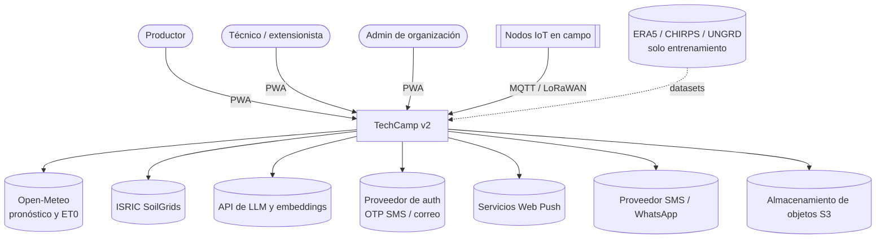
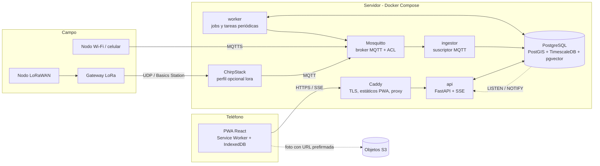
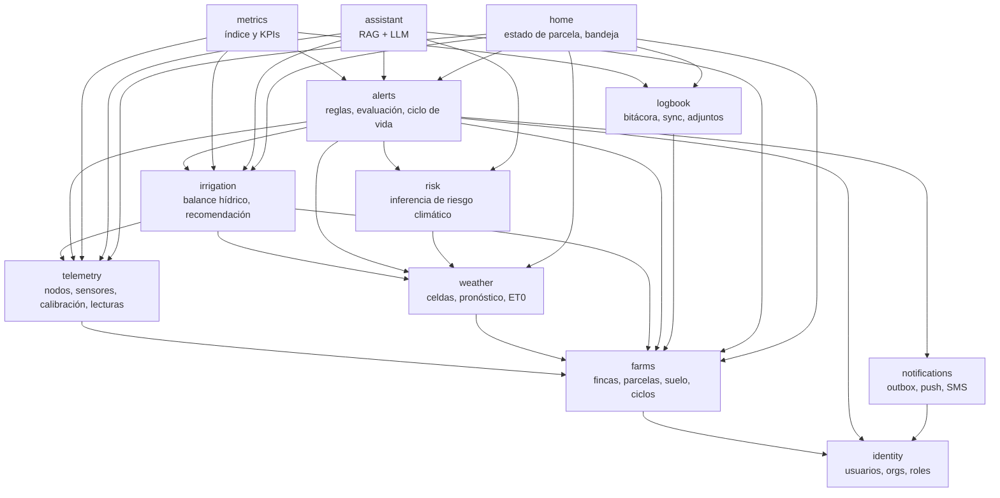
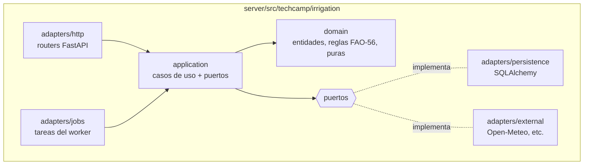
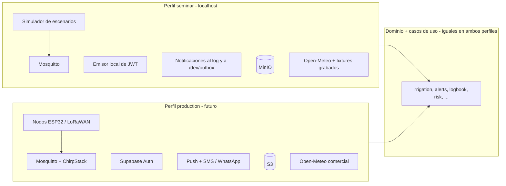
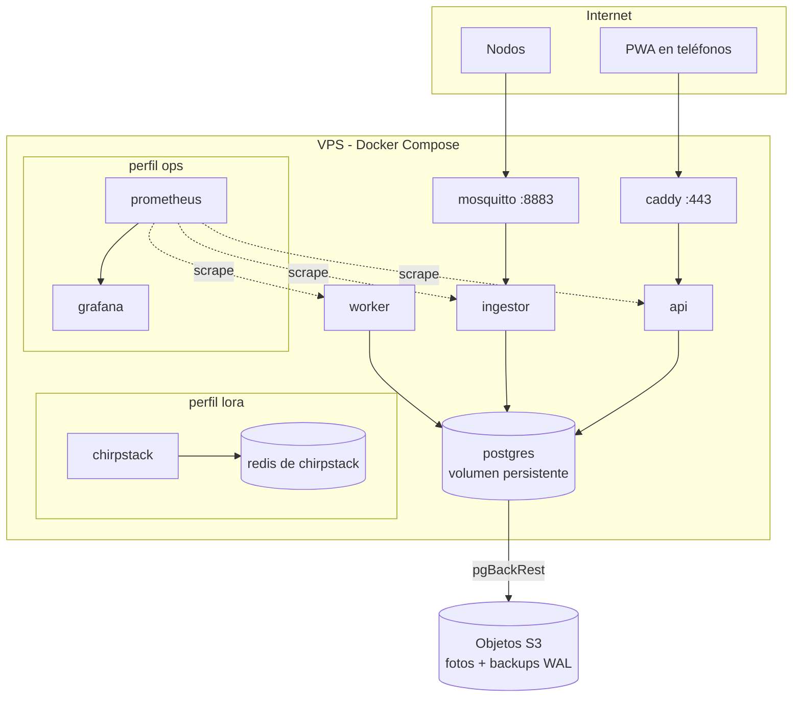

# 05 — Arquitectura de alto nivel

TechCamp v2 es un **monolito modular** en Python: una base de código y tres procesos (`api`, `ingestor`, `worker`) que comparten una sola base PostgreSQL. La PWA en React consume la API. Los nodos IoT publican por MQTT. Nada de microservicios, Redis ni Kafka: con 11 escrituras/s ([02-estimaciones](02-estimaciones.md)) no hacen falta, y cada pieza extra es algo más que operar con un equipo pequeño ([ADR-0002](adr/0002-monolito-modular.md)).

## Contexto (C4 nivel 1)



## Contenedores (C4 nivel 2)



| Contenedor | Responsabilidad | Escala horizontal |
|---|---|---|
| **Caddy** | TLS automático, sirve la PWA, proxy a `/api` y SSE sin buffer | No hace falta |
| **api** | HTTP, autorización, casos de uso de lectura y escritura, SSE | Sí, sin estado; SSE recibe eventos por `LISTEN/NOTIFY` |
| **ingestor** | Consume MQTT, valida, deduplica, calibra, inserta en lote, evalúa reglas de alerta en caliente | Sí, con suscripciones compartidas de MQTT 5 (`$share/ingestors/…`) |
| **worker** | Jobs: clima, balance hídrico, recomendaciones, riesgo, notificaciones (outbox), métricas mensuales, recalibración | Sí; la cola en Postgres usa `SKIP LOCKED` |
| **Mosquitto** | Broker MQTT con TLS, credenciales por nodo, ACL y persistencia | Vertical; alcanza con amplio margen |
| **ChirpStack** | Servidor de red LoRaWAN; decodifica el payload y lo publica en MQTT | Solo si hay gateways LoRa |
| **PostgreSQL** | Fuente de verdad única | Vertical, y réplica de lectura en el año 3 |

`api`, `ingestor` y `worker` usan **la misma imagen** con distinto comando. Un cambio de dominio se despliega una sola vez. El comando del `ingestor` es `python -m techcamp.ingestor`, el módulo de composición donde se inyecta al pipeline de `telemetry` el evaluador de reglas de umbral sobre lecturas ([06 §3](06-diseno-detallado.md#3-alertas-y-notificaciones)): `telemetry` nunca importa a `alerts`, el hook se inyecta desde la raíz de composición.

## Módulos (C4 nivel 3)

Arquitectura con nombres que "gritan" el dominio (screaming architecture): la carpeta raíz del backend lista lo que hace el negocio, no capas técnicas.



D14: `alerts` depende de `farms` e `identity` para obtener el suelo de la parcela, el técnico de la finca y los miembros de la organización; `notifications` depende de `identity` para las suscripciones push y el teléfono del usuario.

D25: `alerts` depende de `irrigation` para la regla `water_stress` sobre el balance hídrico: lee `water_balance_daily` (el θ_estrés y el `Dr > RAW` de la parcela, [§3](06-diseno-detallado.md#3-evaluación-de-alertas) y [§5](06-diseno-detallado.md#5-riego-balance-hídrico-fao-56) de [06](06-diseno-detallado.md), [ADR-0022](adr/0022-estres-hidrico-y-asimilacion.md)) y comparte con el job de riego la regla del sensor representativo (`K > 0`). La dependencia es de su paquete `application` (una lectura), nunca de su `domain`, y nunca al revés: `irrigation` no depende de `alerts`, así que el job de riego sigue sin llamar a ninguna regla.

D-T0.1 (E9): `home` es un módulo de solo lectura que arma la pantalla de inicio (`GET /plots/{plot_id}/status`) y la bandeja del técnico (`GET /me/tray`) ([04](04-api.md#estado-de-la-parcela-pantalla-principal)). Llama a consultas de la fachada `application` de `farms`, `telemetry`, `weather`, `irrigation`, `alerts` y `logbook`; no tiene tablas y ningún módulo depende de él. No vive en `alerts` porque eso le daría a `alerts` una dependencia de `logbook` que nada tiene que ver con alertas, ni en un router suelto porque el orden, las reglas de `null` y la etapa del cultivo merecen pruebas de aplicación.

**Reglas de dependencia** (verificadas en CI con `import-linter`):

| Regla | Detalle |
|---|---|
| Sin ciclos | Las flechas del grafo anterior son las únicas permitidas. |
| Solo la fachada pública | Un módulo solo importa el paquete `application` público de otro, nunca su `domain` ni sus `adapters`. |
| Lecturas cruzadas | Si un módulo necesita datos de otro, llama a una consulta de su fachada; no hace joins entre tablas ajenas. `metrics` es la única excepción: lee vistas SQL de solo lectura porque agrega datos de todos. |
| Eventos | La comunicación asíncrona usa la tabla outbox y el worker, nunca llamadas en segundo plano dentro del proceso. |

### Estructura hexagonal de cada módulo



| Capa | Contiene | Depende de |
|---|---|---|
| `domain` | Entidades, value objects y reglas puras (cálculo de ETc, histéresis de alertas). Sin I/O. | Nada |
| `application` | Casos de uso, puertos (protocolos) y DTOs. Maneja las transacciones. | `domain` |
| `adapters` | HTTP, persistencia, MQTT, APIs externas y jobs | `application` |

Un puerto se crea solo cuando hay dos implementaciones reales o cuando el I/O externo necesita un doble en los tests (por ejemplo, el LLM o Open-Meteo). Nada de interfaces con una sola implementación "por si acaso".

## Estructura del repositorio

```
techcamp-v2/
├── docs/                 # este diseño + ADRs
├── web/                  # PWA (React + Vite + TypeScript)
├── server/               # backend (FastAPI), un paquete por módulo de dominio
│   └── src/techcamp/{identity,farms,telemetry,weather,irrigation,alerts,
│                     notifications,logbook,risk,metrics,assistant,home,shared}
├── ml/                   # entrenamiento offline (dependencias pesadas); publica artefactos
├── firmware/             # firmware de referencia del nodo ESP32 + simulador de nodo
├── infra/                # compose, Caddyfile, config de Mosquitto y ChirpStack
└── odd/                  # tareas de desarrollo
```

`ml/` está separado de `server/`: el entrenamiento necesita dependencias pesadas (xarray, cdsapi y otras) que la imagen del servidor no debe cargar. El servidor solo carga los artefactos `joblib` promovidos ([ADR-0019](adr/0019-reconstruccion-de-modelos.md)).

## Stack

| Capa | Tecnología |
|---|---|
| PWA | React 19, Vite, TypeScript estricto, React Router, TanStack Query, Dexie (IndexedDB), `vite-plugin-pwa` (Workbox), Tailwind CSS v4, shadcn/ui (Radix), Leaflet (carga diferida), uPlot para series de tiempo |
| Cliente de API | Tipos generados desde OpenAPI (`openapi-typescript` + `openapi-fetch`) |
| Backend | Python 3.12, FastAPI, Pydantic v2, SQLAlchemy 2 async + asyncpg, Alembic, aiomqtt, httpx, procrastinate (jobs en Postgres), scikit-learn + joblib (solo inferencia) |
| Datos | PostgreSQL 16+ con PostGIS, TimescaleDB y pgvector |
| IoT | Mosquitto 2, ChirpStack v4 (opcional), nodos ESP32 |
| IA | API de LLM y de embeddings de bajo costo detrás de un puerto ([ADR-0007](adr/0007-llm-por-api.md)) |
| Operación | Docker Compose, Caddy, pgBackRest, Prometheus + Grafana (perfil `ops`) |
| Calidad | ruff, mypy, pytest, import-linter; ESLint, Vitest, Playwright |

Las versiones exactas se fijan al crear cada paquete, con la documentación vigente.

## Perfiles de ejecución

La misma base de código corre con dos perfiles ([ADR-0021](adr/0021-perfil-seminario-local.md)). Solo cambian los adaptadores de los puertos; el dominio y los casos de uso son idénticos.



**Levantar el perfil seminario:**

```bash
cp .env.example .env                  # TECHCAMP_PROFILE=seminar, clave del LLM opcional
docker compose --profile seminar up   # postgres, migrate, mosquitto, minio, api, ingestor, worker, web
sim run --scenario el-nino --backfill 14d --live
```

El servicio `migrate` es de un solo uso: corre `alembic upgrade head` y termina con código 0.
`api`, `ingestor` y `worker` arrancan solo cuando `migrate` termina bien
(`service_completed_successfully`), así que un volumen nuevo queda migrado a la cabeza sin pasos manuales.

La PWA queda en `http://localhost:5173`. Para abrirla en un teléfono se usa un túnel HTTPS (cloudflared o ngrok), porque el Service Worker y el push exigen HTTPS fuera de `localhost`.

## Despliegue (perfil production, futuro)



Solo se exponen al exterior los puertos 443 (Caddy) y 8883 (MQTT con TLS), más 1700/UDP si se usa el perfil `lora`. Postgres no se expone.
