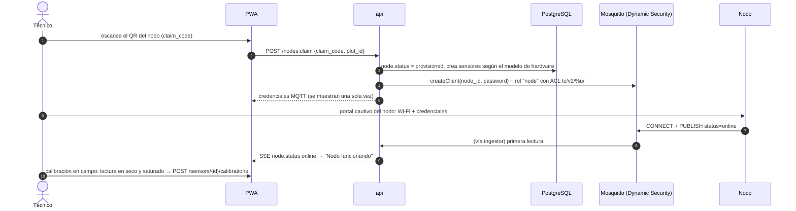
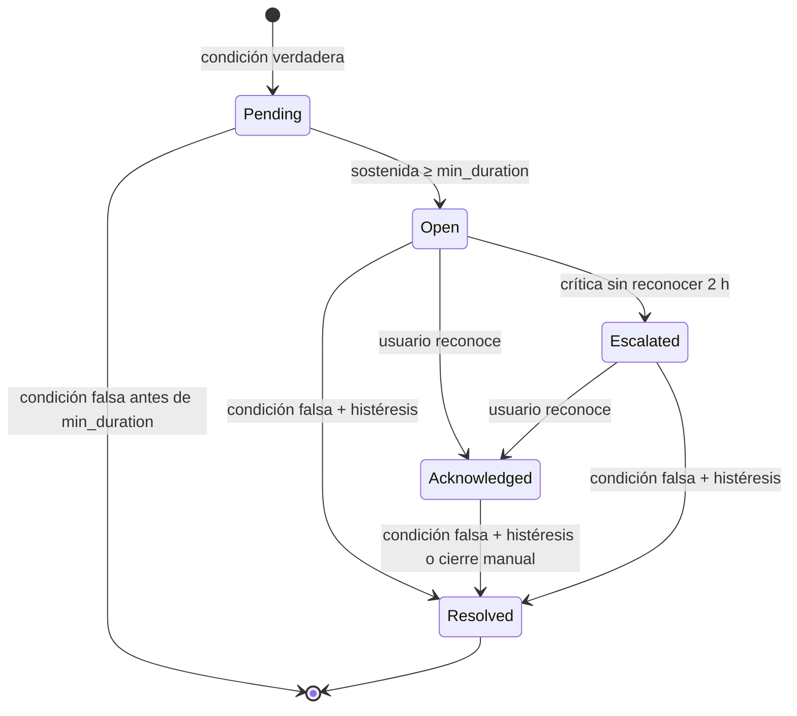
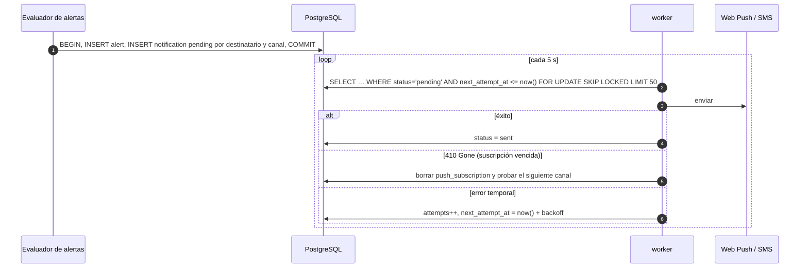
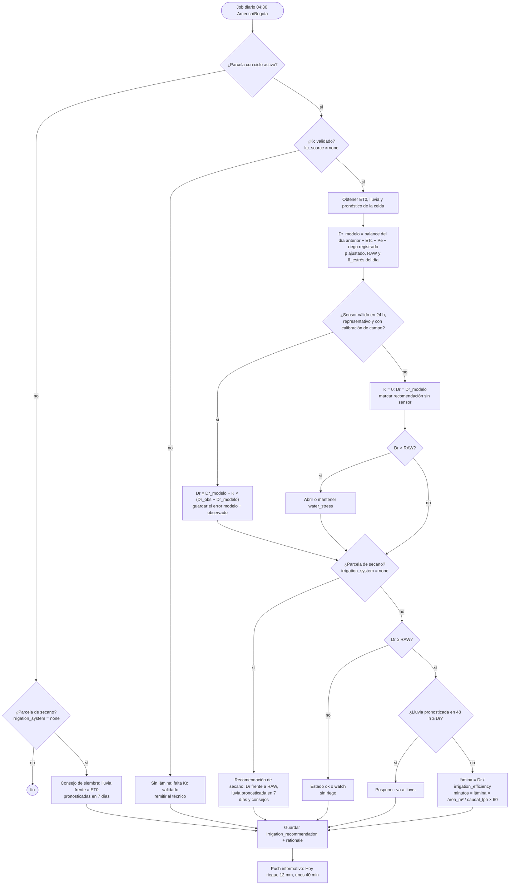
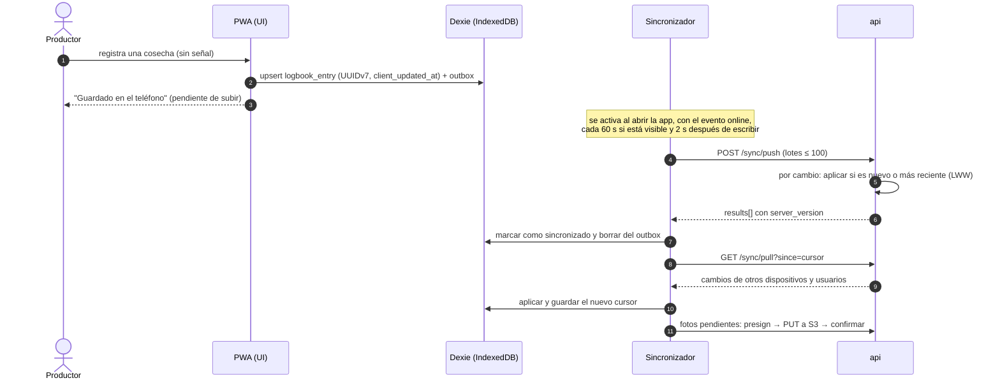
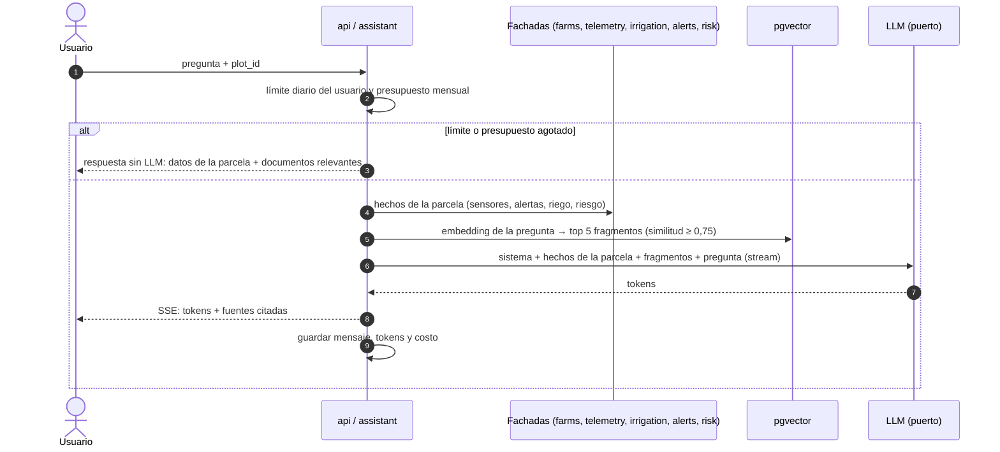
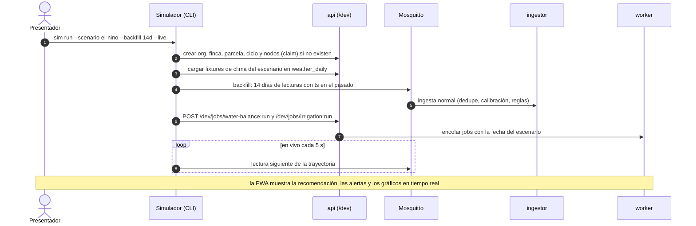

# 06 — Diseño detallado

Aquí se detallan los flujos que concentran el riesgo del sistema. Cada sección es independiente y se puede leer sola.

| # | Flujo | Por qué es crítico |
|---|---|---|
| 1 | [Ingesta de telemetría](#1-ingesta-de-telemetría) | Es la ruta más cargada y nunca debe perder ni duplicar datos |
| 2 | [Alta de un nodo](#2-alta-de-un-nodo) | Es la primera experiencia del técnico y la base de la seguridad IoT |
| 3 | [Evaluación de alertas](#3-evaluación-de-alertas) | Demasiadas alertas se ignoran; si faltan, hay pérdidas |
| 4 | [Notificaciones (outbox)](#4-notificaciones-outbox) | Tienen que llegar aunque falle el proveedor |
| 5 | [Riego FAO-56](#5-riego-balance-hídrico-fao-56) | Es la recomendación principal del producto |
| 6 | [Clima](#6-clima) | Es una dependencia externa con límites de uso |
| 7 | [Sincronización offline](#7-sincronización-offline-de-la-bitácora) | Es la promesa de que nada se pierde en el campo |
| 8 | [Riesgo climático](#8-inferencia-de-riesgo-climático) | Es el primer modelo propio de la v2 y el más expuesto a fuga de datos |
| 9 | [Asistente](#9-asistente-agronómico) | Controla el costo y evita respuestas inventadas |
| 10 | [Simulador de escenarios](#10-simulador-de-escenarios-perfil-seminario) | Es la fuente de datos del seminario y la base de la demo |

## 1. Ingesta de telemetría

```mermaid
sequenceDiagram
  autonumber
  participant N as Nodo
  participant B as Mosquitto
  participant I as ingestor
  participant DB as PostgreSQL
  participant A as api (SSE)

  N->>B: PUBLISH tc/v1/{node}/up (QoS 1)
  B-->>N: PUBACK
  B->>I: entrega (sesión persistente)
  I->>I: validar esquema v, mapear channel_key → sensor
  I->>I: calibrar raw → value, marcar quality
  Note over I: acumula hasta 500 mensajes o 1 s
  I->>DB: INSERT … ON CONFLICT (sensor_id, time) DO NOTHING
  I->>DB: UPDATE node SET last_seen_at, status='online'
  I->>I: evaluar reglas en caliente para las parcelas afectadas
  I->>DB: INSERT alert + notification (una sola transacción, ADR-0016) después del commit del lote; si el proceso cae entre ambos, el siguiente lote reevalúa sobre las lecturas ya guardadas, porque la evaluación es sin estado (D16)
  I->>DB: NOTIFY plot_events
  DB-->>A: evento → SSE a los clientes suscritos
```

| Paso | Regla |
|---|---|
| Validación | Si `v` es desconocida, el `channel_key` no existe o el payload está mal formado, el mensaje se descarta, se cuenta en `ingest_rejected_total{reason}` y se guarda en `ingest_dead_letter` para diagnosticar. |
| Tiempo | Si `ts` está en el futuro (> 10 min) o falta, se usa `received_at` con `quality = 1`. Si es anterior a 30 días, se descarta. Un `ts` que no se puede convertir a una fecha real (desbordamiento, o un reloj que nunca se inicializó) hace el payload mal formado y el mensaje se descarta: no hay `ts` válido que corregir, así que no aplica la corrección por `received_at`. |
| Rango físico | Un valor calibrado fuera del rango de la variable (por ejemplo, humedad > 100 %) activa la bandera 2 de `quality` y no dispara alertas. |
| Los dos casos a la vez | `quality` es un campo de banderas ([03](03-modelo-datos.md), tabla `reading`): si la lectura cae en ambos casos (`ts` corregido y fuera de rango) se guarda `quality = 3` y cada bandera se lee por separado. Antes se guardaba solo `2` y la corrección de `ts` se perdía. |
| Sin calibración vigente (T4, gap) | Si no hay `calibration` con `valid_from <= time` para el sensor, se guarda la lectura con `raw_value` y `value = null` (no se descarta). Los docs no cubrían este caso; el esquema ya modela `value` como nullable. |
| Lote | Inserción en lote cada 500 mensajes o 1 s. Con 110 msg/s de pico (año 3) queda muy lejos del límite. |
| Duplicados | La restricción `UNIQUE (sensor_id, time)` más `ON CONFLICT DO NOTHING` hace idempotente la entrega "al menos una vez" de QoS 1. Solo las lecturas realmente insertadas emiten un evento `reading`: una redelivery no inserta nada y, por tanto, no vuelve a notificar al fan-out por SSE. |
| Estado del nodo | `UPDATE node SET last_seen_at, status` solo avanza: se aplica únicamente si el `last_seen_at` guardado es más antiguo. Los lotes de uplink y de status se vacían por separado, así que un uplink recibido antes de un Last Will `offline` puede escribirse después; sin esta guarda el nodo volvería a `online` con una fecha más antigua. |
| Huecos | Un salto en `seq` incrementa `ingest_gap_total`. La completitud diaria por nodo es un SLI ([11-metricas](11-metricas.md)). |

> **Límite conocido:** la librería MQTT confirma el mensaje al recibirlo, así que si el ingestor cae entre la confirmación y la inserción se pierde como máximo un lote (≤ 1 s). Se detecta como hueco de `seq`. Si la completitud baja del SLO, se pasa a confirmación manual después del `INSERT`.

## 2. Alta de un nodo



- El `claim_code` va impreso en el nodo, es de un solo uso y se genera al fabricar o flashear el nodo.
- La contraseña se guarda como hash en la base. Mosquitto guarda la suya en el plugin Dynamic Security. Rotarla invalida la anterior de inmediato.
- Si se pierde un nodo, se marca `retired` y se deshabilita su cliente MQTT.

## 3. Evaluación de alertas

Hay cinco fuentes de alertas, todas en el mismo módulo `alerts`:

| Fuente | Dónde se evalúa | Ejemplo |
|---|---|---|
| Umbral sobre lecturas | `ingestor`, en caliente, después de cada lote | Humedad del sensor representativo < θ_estrés de la parcela durante ≥ 6 h |
| Balance hídrico | `worker`, después del balance diario ([§5](#5-riego-balance-hídrico-fao-56)) | `Dr > RAW` en una parcela sin sensor representativo |
| Pronóstico | `worker`, después de actualizar el clima | Lluvia > 50 mm en 24 h con el suelo ya saturado |
| Modelo | `worker`, después de la inferencia de riesgo | Probabilidad de inundación con severidad `alto` o `crítico` |
| Salud del nodo | `worker`, cada 5 min | Sin lecturas durante 3 intervalos; batería < 3,4 V |

Para evitar alertas intermitentes (flapping), cada regla define `min_duration_min` e `hysteresis`. En `water_stress` el umbral no es fijo: es el θ_estrés de la parcela que el job de riego recalcula cada día ([§5](#5-riego-balance-hídrico-fao-56)). En el escenario A (maíz en franco arenoso) vale 15,3 %: la alerta abre con humedad < 15,3 % sostenida 6 h y solo se resuelve con > 18,3 % (15,3 + 3) sostenida 1 h.



- **Una sola alerta abierta** por (`rule_id`, `plot_id`/`node_id`). Lo garantiza un índice único parcial en la base, no el código.
- `Pending` no se persiste como alerta; la condición sostenida se evalúa sin estado sobre las lecturas de la ventana (`min_duration_min` hacia atrás desde la última lectura), iniciando la racha en la primera lectura tras la última que incumplió la condición.
- **Tolerancia de huecos y frescura:** dos lecturas solo cuentan como consecutivas si no media un hueco mayor que `max_gap`, que es 3 × `interval_s` del nodo que las produjo (el mismo margen que define `node_offline`). Un hueco mayor termina la racha igual que una lectura que incumple: la racha reinicia en la lectura siguiente al hueco. Y si la última lectura es más antigua que `max_gap` en el momento de evaluar, no hay racha: el nodo está caído y lo almacenado no es evidencia de que la condición siga vigente. Aplica igual a la racha que abre una alerta y a la de 60 min que la resuelve.
- **Ventana de resolución:** la resolución automática exige que la condición de cierre (superando la banda de histéresis) se mantenga sostenida durante 60 minutos (constante de dominio).
- **Reloj de escalamiento:** el plazo de 2 h para escalar una alerta crítica no reconocida corre desde `opened_at`; una alerta ascendida a crítica tras 48 h escala en su siguiente revisión.
- Escalar una alerta crítica notifica por SMS o WhatsApp al técnico asignado a la finca (`farm.technician_id`).
- Las alertas de nodo van al técnico, no al productor ([01-requisitos](01-requisitos.md), escenario C).

**Reglas de fábrica** (`org_id = null`). Los umbrales se validan con un agrónomo antes del piloto:

| Código | Condición | Severidad |
|---|---|---|
| `water_stress` | Con sensor representativo: humedad < θ_estrés de la parcela durante 6 h. Sin él: `Dr > RAW` en el balance diario ([ADR-0022](adr/0022-estres-hidrico-y-asimilacion.md)) | warning; crítica si dura 48 h |
| `waterlogging` | Humedad de suelo > capacidad de campo + 5 durante 24 h | warning |
| `heat_stress` | Temperatura del aire > 35 °C durante 3 h | warning |
| `fungal_risk` | Humedad relativa > 85 % durante ≥ 10 h en el día y temperatura media de 20–30 °C | warning |
| `heavy_rain_forecast` | Pronóstico > 50 mm en 24 h | warning; crítica si el suelo está saturado |
| `flood_risk` / `drought_risk` | Severidad del modelo ≥ `alto` | crítica |
| `node_offline` | Sin lecturas durante 3 intervalos | warning (al técnico) |
| `node_battery_low` | `battery_v` < 3,4 V | info (al técnico) |

## 4. Notificaciones (outbox)



| Regla | Valor |
|---|---|
| Garantía | La alerta y su notificación se guardan en la misma transacción: no hay alerta sin aviso ni aviso sin alerta. |
| Reintentos | Backoff exponencial: 1 min, 5 min, 30 min, 2 h; máximo 5 intentos, luego `failed`. |
| Circuit breaker | Por proveedor. Con 5 fallos seguidos se abre 5 min; mientras tanto las críticas pasan al canal alterno. |
| Horas de silencio | 20:00–05:00: solo notificaciones críticas; el resto se agrupa para las 05:00. |
| Agrupación | Varias alertas no críticas de la misma finca en 15 min se envían en una sola notificación. |
| Canales por severidad | `info`: solo dentro de la app. `warning`: push. `critical`: push y, si no se reconoce, SMS o WhatsApp. |

## 5. Riego: balance hídrico FAO-56

Método de **coeficiente de cultivo único** de FAO-56 (capítulos 6 y 8) ([ADR-0009](adr/0009-riego-fao56.md)). El estrés hídrico se define por parcela y la humedad del sensor corrige el balance con un peso según su calibración ([ADR-0022](adr/0022-estres-hidrico-y-asimilacion.md); brechas G01–G03 y G18 de la [investigación](investigacion/tecnificacion-campo.md#4-matriz-de-brechas)).

| Símbolo | Cálculo | Fuente |
|---|---|---|
| ET0 | mm/día | Open-Meteo `et0_fao_evapotranspiration` de la celda |
| Kc | Por etapa; interpolación lineal durante el desarrollo | `crop_stage` |
| ETc | `Kc × ET0` | — |
| TAW | `1000 × (θFC − θWP) × Zr` | `soil_profile`; Zr es la profundidad de raíz en metros |
| p | `p_tabla + 0,04 × (5 − ETc)`, acotado a 0,1–0,8 | `crop_stage.depletion_fraction_p` (FAO-56, Tabla 22) |
| RAW | `p × TAW` | — |
| θ_estrés | `θFC − p × (θFC − θWP)`: la humedad a la que `Dr = RAW` | Se guarda en `water_balance_daily.stress_moisture_pct` para la regla `water_stress` |
| Pe | `0,8 × P` si P > 5 mm; si no, 0 | Lluvia de la celda o del pluviómetro del nodo |
| Dr modelado | `Dr_modelo(i) = clamp(Dr(i−1) − Pe − I + ETc, 0, TAW)` | Balance diario |
| Dr observado | `1000 × (θFC − θobs) × Zr` | Promedio diario de humedad del sensor representativo |
| Dr | `Dr_modelo + K × (Dr_obs − Dr_modelo)` | Asimilación ponderada; `K` según la tabla siguiente |

**Peso del sensor (`K`).** Un sensor capacitivo barato no es la verdad de la zona de raíces: con calibración de laboratorio llevada al campo su error es de 5,5–19 puntos de humedad, y con calibración de campo baja a 0,5–3,6 puntos ([investigación, H3.2](investigacion/tecnificacion-campo.md#rq3--supuestos-técnicos)). Por eso el sensor corrige el balance, no lo reemplaza:

| Situación del sensor | `K` |
|---|---|
| Sin lectura válida en 24 h, calibración `lab` o profundidad no representativa | 0 (solo modelo; recomendación marcada "sin sensor") |
| Calibración `field` y profundidad representativa | 0,5 (valor inicial; se ajusta con el error modelo − observado registrado) |

- **Profundidad representativa:** un sensor cerca de la mitad de la zona de raíces (Zr/2), o el promedio de dos sensores a profundidades distintas dentro de ella. Un sensor a 10 cm no representa la raíz del maíz (1,0–1,7 m en FAO-56). La tolerancia alrededor de Zr/2 y las profundidades por cultivo están pendientes de validación agronómica.
- **Sensor representativo** es el que cumple las condiciones de `K > 0`: lectura válida en 24 h, profundidad representativa y calibración `field`. Solo ese sensor alimenta la regla `water_stress` sobre lecturas.
- `K` es fijo por tipo de calibración. Si el error modelo − observado sigue alto con datos reales, el paso siguiente es un filtro de Kalman que estime `K` cada día a partir de la varianza del modelo y del sensor.



- **Eficiencia del sistema:** `plot.irrigation_efficiency`, que al crear la parcela toma el valor por defecto de su `irrigation_system`: goteo 0,90, aspersión 0,75, gravedad 0,60.
- **`kind`** de la recomendación según la rama: `irrigate` (lámina), `postpone` (va a llover), `not_needed` (ok o watch), `no_kc` o `rainfed` ([03](03-modelo-datos.md#plot-e-irrigation_recommendation-parcelas-con-riego-y-de-secano)).
- **`rationale`** guarda los números usados (ET0, Kc y su `kc_source`, p, RAW, Dr modelado y asimilado, `K`, pronóstico). Lo muestra la interfaz y lo usa el asistente para explicar la recomendación. Un Kc `approximate` se muestra como tal.
- Con sensor representativo, `water_stress` la abre la regla sobre lecturas contra el θ_estrés del día; sin él, la abre este job cuando `Dr > RAW` ([§3](#3-evaluación-de-alertas)). Vale igual en secano.
- El error entre modelo y observación es el SLI "error de humedad" ([11-metricas](11-metricas.md)).
- **Semántica temporal de la corrida:** una corrida para el día local D (America/Bogota) calcula la fila de balance para D−1 con el clima observado consolidado de ese día (o pronóstico si falta el observado, señalado en el `rationale`); y guarda la recomendación para el día D a partir de Dr(D−1), evaluando la lluvia pronosticada a 48 h (D..D+1) y a 7 días (D..D+6) y la ET0 pronosticada a 7 días. El día del ciclo es `(D−1 − sown_on).days + 1`; el balance previo es el de D−2 (`Dr_prev = 0` si falta). Clima con `fetched_at` de más de 24 h se marca `low_confidence` en el `rationale`.
- **Datos de suelo incompletos:** si el `soil_profile` de la parcela carece de θFC, θWP o `root_depth_cm` (Zr), no se guarda fila de balance ni recomendación para el día; el job registra la omisión.

### Parcelas de secano

Una parcela con `irrigation_system = none` no recibe lámina, pero el balance corre igual: el riego registrado es 0 y el agua solo entra por la lluvia ([ADR-0023](adr/0023-parcelas-con-riego-y-secano.md); brecha G06 de la [investigación](investigacion/tecnificacion-campo.md#4-matriz-de-brechas)). La recomendación (`kind = rainfed`) trae:

- el déficit: `Dr` frente a RAW, y si el cultivo ya está en estrés (`Dr > RAW`);
- la lluvia pronosticada en los próximos 7 días (Pe de la celda);
- los consejos (`advice`) que salen de esta tabla, evaluada en orden. Se incluyen todos los que se cumplen.

Las reglas y sus textos están **pendientes de validación agronómica**:

| Código | Cuándo aplica | Consejo al productor |
|---|---|---|
| `delay_sowing` | Sin ciclo activo y lluvia pronosticada en 7 días < ET0 pronosticada en 7 días | "Espere para sembrar: esta semana no se espera lluvia suficiente" |
| `rain_expected` | `Dr ≥ RAW` y lluvia pronosticada en 7 días ≥ Dr | "Se espera lluvia que repone el agua del suelo" |
| `conserve_moisture` | `Dr ≥ RAW` y lluvia pronosticada en 7 días < Dr | "Cubra el suelo con rastrojo (mulch) y controle malezas para conservar la humedad" |
| `prioritize_harvest` | `conserve_moisture` en la etapa `late` | "Priorice la cosecha: la sequía puede aumentar las pérdidas" |
| `no_action` | `Dr < RAW` | "El suelo tiene agua suficiente para el cultivo" |

- El push matutino de secano solo sale cuando cambian los consejos del día anterior, para no repetir el mismo aviso cada mañana.
- `water_stress` y los días en estrés se calculan igual que en una parcela con riego ([11-metricas](11-metricas.md)).

## 6. Clima

- Las parcelas se agrupan en **celdas de 0,1°** (`weather_cell`). Se consulta una vez por celda, no por parcela.
- La celda de una parcela es la del **centroide** de su polígono, redondeado a 0,1°: el mismo punto que la consulta de suelo, así que la parcela y su clima nunca se contradicen. La celda es compartida entre organizaciones.
- Un job cada 3 h actualiza el pronóstico de las celdas activas, y uno diario consolida el día anterior como observado (`is_forecast = false`).
- El job diario también reintenta, para cada celda activa, los últimos `RETRY_WINDOW_DAYS` días (constante pequeña, 7) anteriores al día objetivo que aún no tengan fila observada: una consolidación degradada por una caída de Open-Meteo termina `succeeded` sin guardar esa fila y nada más la reintenta, así que el siguiente 03:00 la completa en vez de dejar un hueco permanente en `weather_daily` que el balance hídrico (E6) leería como lluvia/ET0 faltante ([#82](https://github.com/jab16jy/techcamp-v2/issues/82)). Una celda sin historial observado encola `RETRY_WINDOW_DAYS + 1` consolidaciones en su primer job diario, lo que es aceptable a la escala del seminario; si el número de celdas crece, este backfill necesita un tope o un throttle.
- Llamadas externas con `httpx`: timeout de 10 s, 3 reintentos con backoff y jitter, y circuit breaker.
- **Degradación:** si Open-Meteo falla se usa el último dato guardado, marcado `stale`, y la interfaz muestra la hora del dato. Una recomendación de riego con clima de más de 24 h de antigüedad se marca como de baja confianza.

## 7. Sincronización offline de la bitácora



| Caso | Comportamiento |
|---|---|
| Visitas de extensión | `extension_visit` usa el mismo sincronizador, outbox y reglas que la bitácora; el técnico la registra en la finca sin señal |
| El mismo cambio llega dos veces | `duplicate`: sin efecto (mismo `id` y mismo `client_updated_at`) |
| Dos dispositivos editan la misma entrada | Gana el `client_updated_at` mayor; el perdedor recibe `conflict_overwritten` y la interfaz lo avisa. Se acepta porque las entradas de bitácora casi nunca las editan dos personas a la vez ([ADR-0013](adr/0013-sincronizacion-offline.md)). |
| Entrada con `alert_id` | El servidor comprueba que la alerta sea de la misma parcela; si no, responde `rejected`. El teléfono toma el `alert_id` de las alertas en caché, así que se puede vincular una acción sin conexión |
| Reloj del teléfono muy desfasado | El servidor rechaza un `client_updated_at` más de 24 h en el futuro (`rejected`); la interfaz pide corregir la hora. |
| Token vencido sin conexión | Se sigue escribiendo en local. Al volver la señal se renueva el token antes de sincronizar. |
| iOS | No hay Background Sync API: la sincronización ocurre con la app en primer plano. |
| Almacenamiento | Se pide `navigator.storage.persist()` para que el navegador no borre IndexedDB. Las fotos se comprimen en el cliente a ≤ 200 KB. |

## 8. Inferencia de riesgo climático


- **Paridad entre entrenamiento y producción:** las features se calculan con el mismo módulo y **la misma fuente** en los dos lados (archivo histórico de Open-Meteo para entrenar, pronóstico y observados recientes de Open-Meteo para inferir). El modelo se construye con el protocolo del [ADR-0020](adr/0020-protocolo-de-experimentacion-ml.md); detalle en [08-ml](08-ml.md#m2-riesgo-de-inundación).
- Cada predicción guarda `model_version_id`: toda alerta se puede rastrear hasta el modelo exacto.

## 9. Asistente agronómico



**Hechos que recibe el LLM.** El `assistant` los arma de forma determinista desde las fachadas, antes de la única llamada al LLM, y el LLM debe citarlos:

- **Sensores** (`telemetry`): última lectura calibrada por variable de la parcela con su `received_at`, y agregados de `reading_daily` de los últimos días. Se marcan las lecturas con `quality` distinto de 0, la versión de calibración vigente del sensor y si el dato no está fresco.
- **Alertas** (`alerts`): alertas abiertas o reconocidas de la parcela con su `severity`, `opened_at` y `evidence`.
- **Riego** (`irrigation`): la `irrigation_recommendation` del día con su `kind`, su `rationale` y, según el caso, `depth_mm` y `duration_min` o los consejos de secano (`advice`).
- **Clima estacional** (`assistant`): el estado ENSO y la perspectiva de lluvia del último boletín agroclimático del departamento de la finca, o del nacional si no hay uno regional, con su fecha de publicación. El estado ENSO (`kb_document.enso_state`) se registra al cargar el boletín; en el seminario viene un boletín fijo con los fixtures.
- **Riesgo climático** (`risk`): la `risk_prediction` vigente de la celda de la parcela con `probability`, `severity` y `top_factors`, más el modelo que la produjo: `model_version.version` y su métrica de validación de `model_version.metrics`. Si la predicción viene de la heurística de línea base, se indica.

En la respuesta sin LLM se devuelven estos mismos hechos junto con los documentos relevantes.

**Corpus (RAG).** Cada documento guarda su fuente y su licencia ([ADR-0008](adr/0008-rag-pgvector.md)). Además de las guías agronómicas revisadas por licencia, el corpus incluye los boletines agroclimáticos: el Boletín Agroclimático Nacional mensual (MADR, FAO e IDEAM) y los de las Mesas Técnicas Agroclimáticas con mesa en el Caribe (Córdoba, Sucre y Magdalena–Cesar–La Guajira–Atlántico). Son la fuente institucional de la perspectiva estacional y ENSO para la región (brecha G08 de la [investigación](investigacion/tecnificacion-campo.md#4-matriz-de-brechas)).

**Reglas del prompt:**

- Responder en español sencillo.
- Usar solo los hechos de la parcela y los fragmentos entregados, y citar la fuente.
- Si no hay información suficiente, decirlo.
- **Nunca inventar dosis de agroquímicos:** remitir a la etiqueta del producto registrado ante el ICA y al técnico.
- El asistente **explica** recomendaciones y alertas que calcula el sistema; no calcula riego ni riesgo por su cuenta.

## 10. Simulador de escenarios (perfil seminario)

El simulador reemplaza a los nodos físicos en el perfil `seminar` ([ADR-0021](adr/0021-perfil-seminario-local.md)). Publica por MQTT con **el mismo contrato** que un nodo real ([04-api](04-api.md#contrato-mqtt)), así que el ingestor, las alertas y el riego no distinguen entre simulado y real.



**Formato de un escenario** (`firmware/simulator/scenarios/<nombre>.yaml`):

```yaml
name: el-nino
description: Estrés hídrico por El Niño en maíz (escenario A)
plot: { crop: maize, sown_days_ago: 42, area_ha: 1.5, soil: sandy_loam, irrigation_system: drip }
soil: { field_capacity_pct: 23, wilting_point_pct: 9 }   # franco arenoso, FAO-56 Tabla 19
nodes: { count: 2, soil_moisture_depth_cm: 30, calibration: field }
interval_s: 900            # intervalo simulado entre lecturas del backfill
weather_fixture: el-nino-caribe.json   # ETc ≈ 5 mm/día → p = 0,55
trajectories:
  soil_moisture_30cm: { start: 22, end: 13, noise: 0.8 }   # % volumétrico; cruza θ_estrés = 15,3 % el día 10,4
  air_temp: { daily_min: 26, daily_max: 37, noise: 0.5 }
  air_rh: { daily_min: 38, daily_max: 70 }
faults:
  - { at_day: 10, node: 2, type: offline, hours: 8 }       # dispara el escenario C
expected:
  alerts: [water_stress, heat_stress, node_offline]
  irrigation: irrigate
```

**Aritmética del escenario A** (brecha G02 de la [investigación](investigacion/tecnificacion-campo.md#4-matriz-de-brechas)). Franco arenoso con θFC = 0,23 y θWP = 0,09; maíz con p_tabla = 0,55; el fixture da ETc ≈ 5 mm/día, así que p = 0,55 + 0,04 × (5 − 5) = 0,55.

- θ_estrés = 0,23 − 0,55 × (0,23 − 0,09) = 0,23 − 0,077 = 0,153 → **15,3 %**.
- Con Zr ≈ 0,6 m el día 42 (supuesto del escenario, pendiente de validación agronómica): TAW = 1000 × 0,14 × 0,6 = 84 mm y RAW = 0,55 × 84 = 46,2 mm. Zr/2 = 30 cm: por eso el sensor está a 30 cm.
- La humedad baja linealmente de 22 % a 13 % en los 14 días del backfill. Cruza 15,3 % en t = 14 × (22 − 15,3) / (22 − 13) ≈ 10,4 días, y `water_stress` abre 6 h después (día ≈ 10,7).
- Al final, θobs = 13 % → Dr_obs = 1000 × (0,23 − 0,13) × 0,6 = 60 mm > RAW = 46,2 mm → `irrigate`.
- El umbral fijo anterior (20 %) se habría cruzado el día 3,1, una semana antes de que hubiera estrés según FAO-56.

**Escenario E: veranillo en maíz de secano** (brecha G06 de la [investigación](investigacion/tecnificacion-campo.md#4-matriz-de-brechas)). Mismo suelo que el escenario A, sin sistema de riego y sin nodo: demuestra la recomendación de secano y el camino "sin sensor" del balance (`K = 0`). Se corre con `sim run --scenario dry-spell-rainfed --backfill 21d`.

```yaml
name: dry-spell-rainfed
description: Veranillo durante la floración en maíz de secano (escenario E)
plot: { crop: maize, sown_days_ago: 60, area_ha: 2, soil: sandy_loam, irrigation_system: none }   # etapa mid (floración); duración de etapas pendiente de validación agronómica
soil: { field_capacity_pct: 23, wilting_point_pct: 9 }   # franco arenoso, FAO-56 Tabla 19
nodes: { count: 0 }        # parcela sin sensor: el balance corre solo con clima
weather_fixture: veranillo-caribe.json   # ET0 ≈ 4,2 mm/día y ninguna lluvia > 5 mm en los 21 días ni en los 7 de pronóstico
expected:
  alerts: [water_stress]   # abierta por el balance diario; crítica desde el día 18
  irrigation: rainfed      # kind de irrigation_recommendation: sin lámina ni minutos
  advice: [conserve_moisture]
```

**Aritmética del escenario E.** Franco arenoso con θFC = 0,23 y θWP = 0,09; maíz en etapa media con Kc = 1,20 y p_tabla = 0,55 (FAO-56, Tablas 12 y 22).

- ETc = 1,20 × 4,2 ≈ 5 mm/día, así que p = 0,55 + 0,04 × (5 − 5) = 0,55 y θ_estrés = 15,3 %, como en el escenario A.
- Con Zr = 1,0 m en floración (extremo inferior de 1,0–1,7 m de FAO-56; supuesto pendiente de validación agronómica): TAW = 1000 × 0,14 × 1,0 = 140 mm y RAW = 0,55 × 140 = 77 mm.
- El día 0 el suelo está a capacidad de campo tras la última lluvia (Dr = 0). Sin lluvia efectiva (Pe = 0 porque ninguna lluvia supera 5 mm) y sin riego, Dr = 5 × día.
- El día 15, Dr = 75 mm ≤ RAW; el día 16, Dr = 80 mm > RAW = 77 mm: el balance abre `water_stress`. Sigue abierta 48 h, así que pasa a crítica el día 18.
- El día 21, Dr = 105 mm, por debajo de TAW = 140 mm (todavía no llega al punto de marchitez). Como `Dr ≥ RAW` y la lluvia pronosticada en 7 días (0 mm) es menor que Dr, el consejo es `conserve_moisture`. La etapa no es `late`, así que no aparece `prioritize_harvest`.

| Escenario | Qué demuestra |
|---|---|
| `el-nino` (A) | Estrés hídrico, alerta crítica, recomendación "regar X mm" |
| `rainy-season` (B) | Humedad relativa alta sostenida, alerta `fungal_risk`, "no regar: va a llover" |
| `node-failure` (C) | Nodo caído, alerta al técnico, hueco en la completitud |
| `offline-farmer` (D) | Se ejecuta en la PWA (modo avión): bitácora offline y sincronización sin duplicados |
| `dry-spell-rainfed` (E) | Parcela de secano sin nodo: estrés abierto por el balance, recomendación de secano sin lámina |
| `normal` | Operación estable, para contrastar |

**Reglas:**

- El simulador envía lecturas en **ADC crudo** y cada nodo simulado tiene su calibración, así que también se demuestra la calibración.
- `expected` convierte cada escenario en una **prueba end-to-end**: CI corre el escenario y verifica las alertas y la recomendación esperadas.
- Un test de dominio verifica, con los parámetros de suelo y cultivo de cada escenario, que `water_stress` abre cuando `Dr > RAW` y no antes.
- La trayectoria sin ruido de cada escenario es la **verdad de referencia** para medir el error del balance hídrico ([11 §3](11-metricas.md#3-calidad-de-decisión)).
- El ruido y las fallas son configurables para mostrar la robustez (lecturas fuera de rango con la bandera 2 de `quality`, huecos de `seq`).
- Los fixtures de clima se graban una vez desde Open-Meteo (`sim record-weather`) y quedan versionados: la demo funciona sin internet, salvo el asistente.

