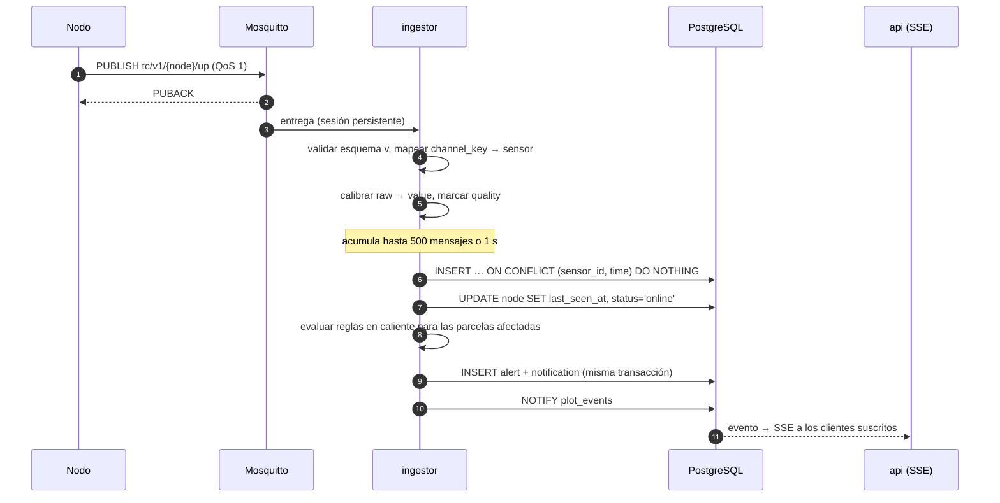
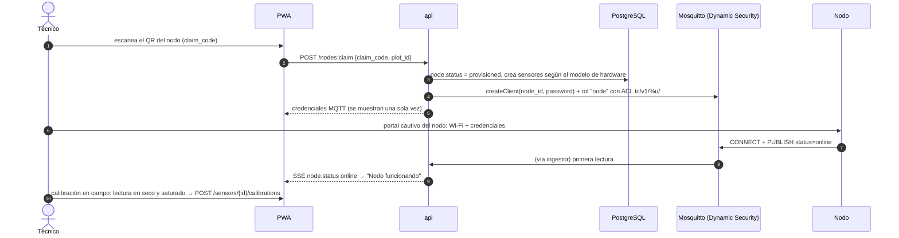
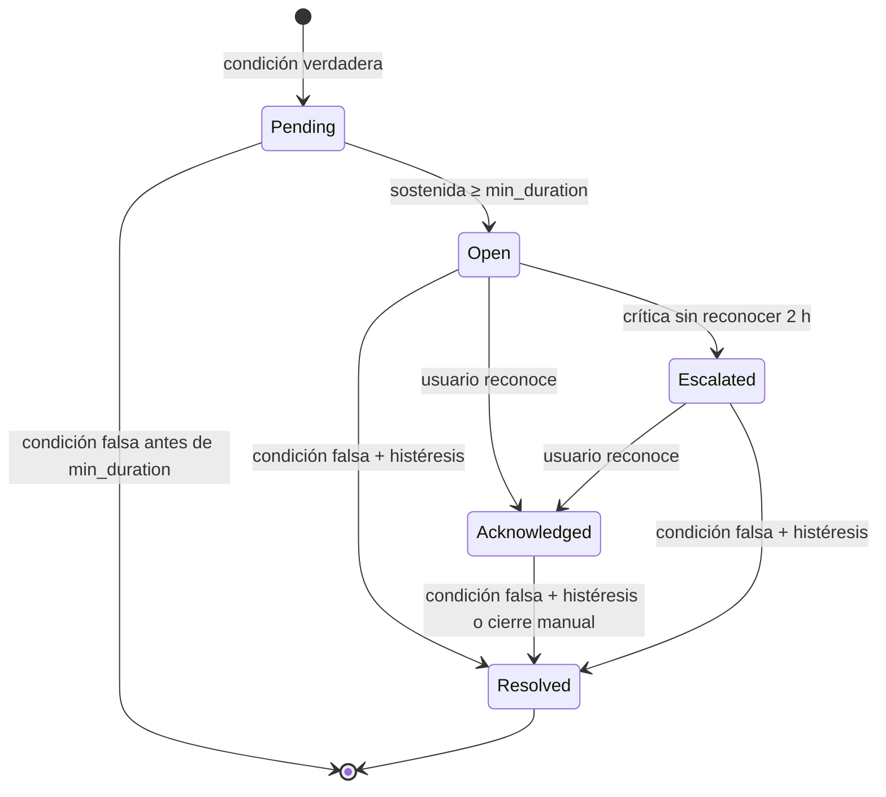
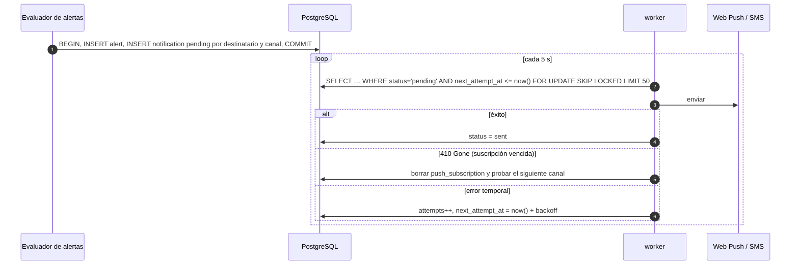
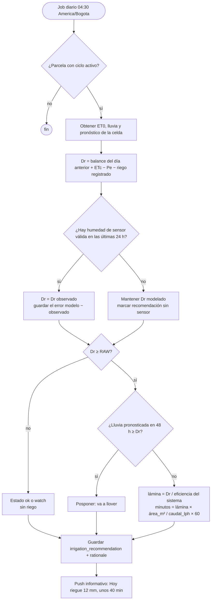
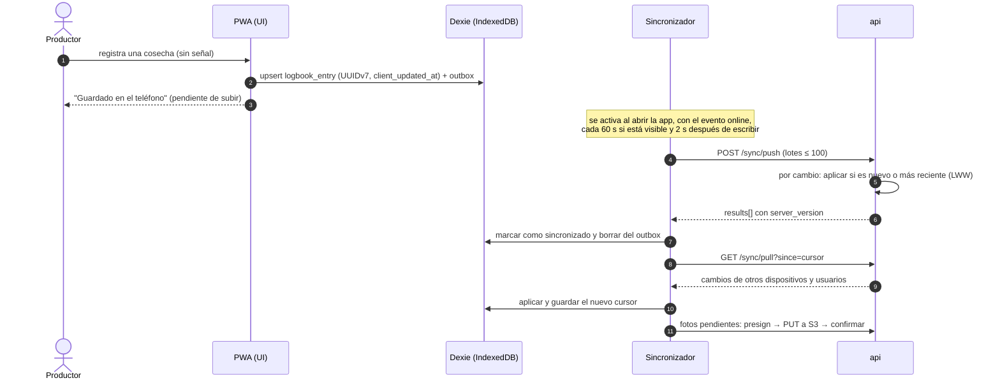
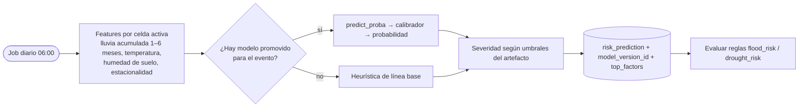
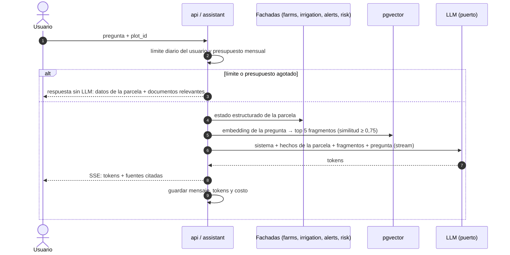
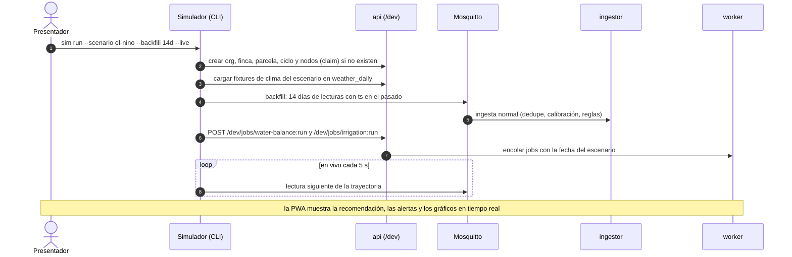

# 06 — Diseño detallado

Aquí se detallan los flujos que concentran el riesgo del sistema. Cada sección es independiente y se puede leer sola.

| # | Flujo | Por qué es crítico |
|---|---|---|
| 1 | [Ingesta de telemetría](#1-ingesta-de-telemetría) | Es la ruta más cargada y nunca debe perder ni duplicar datos |
| 2 | [Alta de un nodo](#2-alta-de-un-nodo) | Es la primera experiencia del técnico y la base de la seguridad IoT |
| 3 | [Evaluación de alertas](#3-evaluación-de-alertas) | Demasiadas alertas se ignoran; si faltan, hay pérdidas |
| 4 | [Notificaciones (outbox)](#4-notificaciones-outbox) | Tienen que llegar aunque falle el proveedor |
| 5 | [Riego FAO-56](#5-riego-balance-hídrico-fao-56) | Es la recomendación principal del producto |
| 6 | [Clima](#6-clima) | Es una dependencia externa con límites de uso |
| 7 | [Sincronización offline](#7-sincronización-offline-de-la-bitácora) | Es la promesa de que nada se pierde en el campo |
| 8 | [Riesgo climático](#8-inferencia-de-riesgo-climático) | Es el primer modelo propio de la v2 y el más expuesto a fuga de datos |
| 9 | [Asistente](#9-asistente-agronómico) | Controla el costo y evita respuestas inventadas |
| 10 | [Simulador de escenarios](#10-simulador-de-escenarios-perfil-seminario) | Es la fuente de datos del seminario y la base de la demo |

## 1. Ingesta de telemetría



| Paso | Regla |
|---|---|
| Validación | Si `v` es desconocida, el `channel_key` no existe o el payload está mal formado, el mensaje se descarta, se cuenta en `ingest_rejected_total{reason}` y se guarda en `ingest_dead_letter` para diagnosticar. |
| Tiempo | Si `ts` está en el futuro (> 10 min) o falta, se usa `received_at` con `quality = 1`. Si es anterior a 30 días, se descarta. |
| Rango físico | Un valor calibrado fuera del rango de la variable (por ejemplo, humedad > 100 %) se guarda con `quality = 2` y no dispara alertas. |
| Lote | Inserción en lote cada 500 mensajes o 1 s. Con 110 msg/s de pico (año 3) queda muy lejos del límite. |
| Duplicados | La restricción `UNIQUE (sensor_id, time)` más `ON CONFLICT DO NOTHING` hace idempotente la entrega "al menos una vez" de QoS 1. |
| Huecos | Un salto en `seq` incrementa `ingest_gap_total`. La completitud diaria por nodo es un SLI ([11-metricas](11-metricas.md)). |

> **Límite conocido:** la librería MQTT confirma el mensaje al recibirlo, así que si el ingestor cae entre la confirmación y la inserción se pierde como máximo un lote (≤ 1 s). Se detecta como hueco de `seq`. Si la completitud baja del SLO, se pasa a confirmación manual después del `INSERT`.

## 2. Alta de un nodo



- El `claim_code` va impreso en el nodo, es de un solo uso y se genera al fabricar o flashear el nodo.
- La contraseña se guarda como hash en la base. Mosquitto guarda la suya en el plugin Dynamic Security. Rotarla invalida la anterior de inmediato.
- Si se pierde un nodo, se marca `retired` y se deshabilita su cliente MQTT.

## 3. Evaluación de alertas

Hay cuatro fuentes de alertas, todas en el mismo módulo `alerts`:

| Fuente | Dónde se evalúa | Ejemplo |
|---|---|---|
| Umbral sobre lecturas | `ingestor`, en caliente, después de cada lote | Humedad de suelo < umbral del cultivo durante ≥ 6 h |
| Pronóstico | `worker`, después de actualizar el clima | Lluvia > 50 mm en 24 h con el suelo ya saturado |
| Modelo | `worker`, después de la inferencia de riesgo | Probabilidad de inundación con severidad `alto` o `crítico` |
| Salud del nodo | `worker`, cada 5 min | Sin lecturas durante 3 intervalos; batería < 3,4 V |

Para evitar alertas intermitentes (flapping), cada regla define `min_duration_min` e `hysteresis`. Una alerta de humedad baja abre con < 20 % sostenido 6 h y solo se resuelve con > 23 % (20 + 3) sostenido 1 h.



- **Una sola alerta abierta** por (`rule_id`, `plot_id`/`node_id`). Lo garantiza un índice único parcial en la base, no el código.
- `Pending` vive en memoria del evaluador y en el estado de la regla; no se persiste como alerta.
- Escalar una alerta crítica notifica por SMS o WhatsApp al técnico asignado.
- Las alertas de nodo van al técnico, no al productor ([01-requisitos](01-requisitos.md), escenario C).

**Reglas de fábrica** (`org_id = null`). Los umbrales se validan con un agrónomo antes del piloto:

| Código | Condición | Severidad |
|---|---|---|
| `water_stress` | Humedad de suelo < `crop.stress_threshold_pct` durante 6 h | warning; crítica si dura 48 h |
| `waterlogging` | Humedad de suelo > capacidad de campo + 5 durante 24 h | warning |
| `heat_stress` | Temperatura del aire > 35 °C durante 3 h | warning |
| `fungal_risk` | Humedad relativa > 85 % durante ≥ 10 h en el día y temperatura media de 20–30 °C | warning |
| `heavy_rain_forecast` | Pronóstico > 50 mm en 24 h | warning; crítica si el suelo está saturado |
| `flood_risk` / `drought_risk` | Severidad del modelo ≥ `alto` | crítica |
| `node_offline` | Sin lecturas durante 3 intervalos | warning (al técnico) |
| `node_battery_low` | `battery_v` < 3,4 V | info (al técnico) |

## 4. Notificaciones (outbox)



| Regla | Valor |
|---|---|
| Garantía | La alerta y su notificación se guardan en la misma transacción: no hay alerta sin aviso ni aviso sin alerta. |
| Reintentos | Backoff exponencial: 1 min, 5 min, 30 min, 2 h; máximo 5 intentos, luego `failed`. |
| Circuit breaker | Por proveedor. Con 5 fallos seguidos se abre 5 min; mientras tanto las críticas pasan al canal alterno. |
| Horas de silencio | 20:00–05:00: solo notificaciones críticas; el resto se agrupa para las 05:00. |
| Agrupación | Varias alertas no críticas de la misma finca en 15 min se envían en una sola notificación. |
| Canales por severidad | `info`: solo dentro de la app. `warning`: push. `critical`: push y, si no se reconoce, SMS o WhatsApp. |

## 5. Riego: balance hídrico FAO-56

Método de **coeficiente de cultivo único** de FAO-56 (capítulos 6 y 8). La humedad medida por el sensor corrige el modelo cada día ([ADR-0009](adr/0009-riego-fao56.md)).

| Símbolo | Cálculo | Fuente |
|---|---|---|
| ET0 | mm/día | Open-Meteo `et0_fao_evapotranspiration` de la celda |
| Kc | Por etapa; interpolación lineal durante el desarrollo | `crop_stage` |
| ETc | `Kc × ET0` | — |
| TAW | `1000 × (θFC − θWP) × Zr` | `soil_profile`; Zr es la profundidad de raíz en metros |
| RAW | `p × TAW` | `crop_stage.depletion_fraction_p` |
| Pe | `0,8 × P` si P > 5 mm; si no, 0 | Lluvia de la celda o del pluviómetro del nodo |
| Dr | `Dr(i) = clamp(Dr(i−1) − Pe − I + ETc, 0, TAW)` | Balance diario |
| Dr observado | `1000 × (θFC − θobs) × Zr` | Promedio diario de humedad del sensor en la zona de raíces |



- **Eficiencia del sistema:** goteo 0,90, aspersión 0,75, gravedad 0,60 (configurable por parcela).
- **`rationale`** guarda los números usados (ET0, Kc, Dr, pronóstico). Lo muestra la interfaz y lo usa el asistente para explicar la recomendación.
- El error entre modelo y observación es el SLI "error de humedad" ([11-metricas](11-metricas.md)).

## 6. Clima

- Las parcelas se agrupan en **celdas de 0,1°** (`weather_cell`). Se consulta una vez por celda, no por parcela.
- Un job cada 3 h actualiza el pronóstico de las celdas activas, y uno diario consolida el día anterior como observado (`is_forecast = false`).
- Llamadas externas con `httpx`: timeout de 10 s, 3 reintentos con backoff y jitter, y circuit breaker.
- **Degradación:** si Open-Meteo falla se usa el último dato guardado, marcado `stale`, y la interfaz muestra la hora del dato. Una recomendación de riego con clima de más de 24 h de antigüedad se marca como de baja confianza.

## 7. Sincronización offline de la bitácora



| Caso | Comportamiento |
|---|---|
| El mismo cambio llega dos veces | `duplicate`: sin efecto (mismo `id` y mismo `client_updated_at`) |
| Dos dispositivos editan la misma entrada | Gana el `client_updated_at` mayor; el perdedor recibe `conflict_overwritten` y la interfaz lo avisa. Se acepta porque las entradas de bitácora casi nunca las editan dos personas a la vez ([ADR-0013](adr/0013-sincronizacion-offline.md)). |
| Reloj del teléfono muy desfasado | El servidor rechaza un `client_updated_at` más de 24 h en el futuro (`rejected`); la interfaz pide corregir la hora. |
| Token vencido sin conexión | Se sigue escribiendo en local. Al volver la señal se renueva el token antes de sincronizar. |
| iOS | No hay Background Sync API: la sincronización ocurre con la app en primer plano. |
| Almacenamiento | Se pide `navigator.storage.persist()` para que el navegador no borre IndexedDB. Las fotos se comprimen en el cliente a ≤ 200 KB. |

## 8. Inferencia de riesgo climático



- **Paridad entre entrenamiento y producción:** las features se calculan con el mismo módulo y **la misma fuente** en los dos lados (archivo histórico de Open-Meteo para entrenar, pronóstico y observados recientes de Open-Meteo para inferir). El modelo se construye con el protocolo del [ADR-0020](adr/0020-protocolo-de-experimentacion-ml.md); detalle en [08-ml](08-ml.md#m2-riesgo-de-inundación).
- Cada predicción guarda `model_version_id`: toda alerta se puede rastrear hasta el modelo exacto.

## 9. Asistente agronómico



**Reglas del prompt:**

- Responder en español sencillo.
- Usar solo los hechos de la parcela y los fragmentos entregados, y citar la fuente.
- Si no hay información suficiente, decirlo.
- **Nunca inventar dosis de agroquímicos:** remitir a la etiqueta del producto registrado ante el ICA y al técnico.
- El asistente **explica** recomendaciones y alertas que calcula el sistema; no calcula riego ni riesgo por su cuenta.

## 10. Simulador de escenarios (perfil seminario)

El simulador reemplaza a los nodos físicos en el perfil `seminar` ([ADR-0021](adr/0021-perfil-seminario-local.md)). Publica por MQTT con **el mismo contrato** que un nodo real ([04-api](04-api.md#contrato-mqtt)), así que el ingestor, las alertas y el riego no distinguen entre simulado y real.



**Formato de un escenario** (`firmware/simulator/scenarios/<nombre>.yaml`):

```yaml
name: el-nino
description: Estrés hídrico por El Niño en maíz (escenario A)
plot: { crop: maize, sown_days_ago: 42, area_ha: 1.5, soil: sandy_loam, system: drip }
nodes: 2
interval_s: 900            # intervalo simulado entre lecturas del backfill
weather_fixture: el-nino-caribe.json
trajectories:
  soil_moisture_10cm: { start: 28, end: 14, noise: 0.8 }   # % volumétrico
  air_temp: { daily_min: 26, daily_max: 37, noise: 0.5 }
  air_rh: { daily_min: 38, daily_max: 70 }
faults:
  - { at_day: 10, node: 2, type: offline, hours: 8 }       # dispara el escenario C
expected:
  alerts: [water_stress, heat_stress, node_offline]
  irrigation: irrigate
```

| Escenario | Qué demuestra |
|---|---|
| `el-nino` (A) | Estrés hídrico, alerta crítica, recomendación "regar X mm" |
| `rainy-season` (B) | Humedad relativa alta sostenida, alerta `fungal_risk`, "no regar: va a llover" |
| `node-failure` (C) | Nodo caído, alerta al técnico, hueco en la completitud |
| `offline-farmer` (D) | Se ejecuta en la PWA (modo avión): bitácora offline y sincronización sin duplicados |
| `normal` | Operación estable, para contrastar |

**Reglas:**

- El simulador envía lecturas en **ADC crudo** y cada nodo simulado tiene su calibración, así que también se demuestra la calibración.
- `expected` convierte cada escenario en una **prueba end-to-end**: CI corre el escenario y verifica las alertas y la recomendación esperadas.
- El ruido y las fallas son configurables para mostrar la robustez (lecturas fuera de rango con `quality = 2`, huecos de `seq`).
- Los fixtures de clima se graban una vez desde Open-Meteo (`sim record-weather`) y quedan versionados: la demo funciona sin internet, salvo el asistente.

