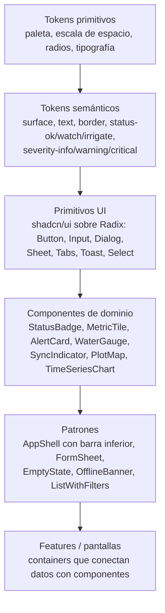
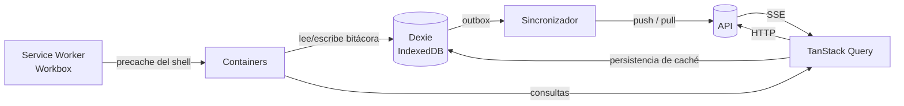
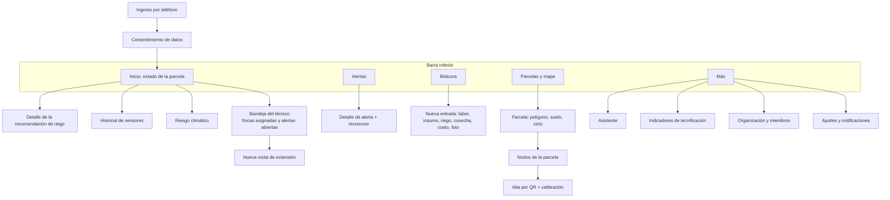

# 07 — Frontend y design system

El principal problema de la v1 era visual y estructural: pantallas hechas una por una, sin tokens ni componentes compartidos. En la v2 **el design system se construye primero**. Ninguna pantalla usa colores, espacios o tamaños que no salgan de los tokens ([ADR-0006](adr/0006-design-system.md)).

## Principios de diseño para campo

| Principio | Regla concreta |
|---|---|
| **Legible a pleno sol** | Tema claro de alto contraste por defecto. Texto con contraste ≥ 7:1 (AAA) en datos críticos; ≥ 4,5:1 en el resto. |
| **Dedos grandes, manos ocupadas** | Áreas táctiles ≥ 48 × 48 px. La acción principal va al alcance del pulgar (barra inferior o botón flotante). |
| **Una decisión por pantalla** | La pantalla de inicio responde "¿qué hago hoy en esta parcela?" antes que cualquier gráfico. |
| **El color nunca va solo** | Todo estado (ok / vigilar / regar; info / advertencia / crítico) lleva icono y texto además del color. |
| **Honesto con la conexión** | Siempre visible: sin conexión, pendientes por subir, hora del último dato. |
| **Lenguaje simple** | Español llano, unidades explicadas ("12 mm ≈ 40 minutos de riego"). Nada de jerga técnica en la vista del productor. |
| **Liviano** | Bundle inicial ≤ 200 KB gzip. Fuente del sistema (sin descargar web fonts). Mapa y gráficos se cargan de forma diferida. |

## Capas del design system



| Capa | Dónde vive | Regla |
|---|---|---|
| Tokens | `web/src/design-system/tokens.css` (`@theme` de Tailwind v4 más variables CSS) | Única fuente de color, espacio, radio y tipografía. El lint prohíbe valores arbitrarios (`bg-[#…]`, `p-[13px]`). |
| Primitivos | `web/src/design-system/ui/` | Componentes shadcn/ui copiados al repositorio y adaptados a los tokens. Son código propio, no una dependencia. |
| Componentes de dominio | `web/src/design-system/components/` | Presentacionales: reciben props y no piden datos. |
| Patrones | `web/src/design-system/patterns/` | Composiciones reutilizables de pantalla. |
| Catálogo | Ruta `/dev/ui` (solo en desarrollo) | Muestra cada componente en todos sus estados. Si el catálogo crece mucho se migra a Storybook. |

### Tokens semánticos iniciales

| Token | Uso |
|---|---|
| `--color-surface`, `--color-surface-raised` | Fondos |
| `--color-text`, `--color-text-muted` | Texto |
| `--color-brand` | Acciones principales |
| `--color-status-ok` / `-watch` / `-irrigate` / `-stress` | Estado del balance hídrico (`stress` solo en secano) |
| `--color-severity-info` / `-warning` / `-critical` | Severidad de alertas |
| `--color-offline` | Indicador sin conexión |
| `--space-1 … --space-8` | Escala de 4 px |
| `--radius-sm / md / lg` | Radios |
| `--text-sm / base / lg / xl / 2xl` | Base de 16 px; los datos clave en `2xl` |

Los valores concretos (paleta y escalas) se definen en la tarea de implementación del design system y se validan en exteriores con un teléfono real.

## Arquitectura del frontend

Carpetas por feature (screaming architecture) y patrón container/presentational:

```
web/src/
├── app/                 # router, providers, AppShell, manejo de errores
├── design-system/       # tokens, ui/, components/, patterns/
├── features/
│   ├── plot-status/     # pantalla de inicio de la parcela
│   ├── alerts/
│   ├── logbook/
│   ├── visits/          # bandeja del técnico y visitas de extensión
│   ├── plots/           # fincas, parcelas, mapa, ciclos
│   ├── nodes/           # alta por QR, calibración, salud
│   ├── irrigation/
│   ├── metrics/
│   ├── assistant/
│   └── auth/
│       └── (cada feature) api/ · containers/ · components/ · routes.tsx
└── lib/
    ├── api/             # cliente generado desde OpenAPI
    ├── db/              # esquema Dexie
    └── sync/            # sincronizador de la bitácora
```

| Regla | Detalle |
|---|---|
| Container | Usa hooks de datos (TanStack Query / Dexie) y pasa props. No tiene estilos propios más allá del layout. |
| Presentational | Sin fetch ni stores. Se puede probar y mostrar en el catálogo de forma aislada. |
| Entre features | Una feature no importa otra; lo compartido baja a `design-system/` o `lib/` (lo verifica ESLint). |
| Estado del servidor | TanStack Query. El estado de UI global mínimo (organización y parcela activas) va en un store pequeño; no hay stores de datos del servidor. |

### Flujo de datos y offline



| Dato | Estrategia |
|---|---|
| Shell de la app (JS, CSS, íconos) | Precache del Service Worker: abre sin red |
| Estado de parcela, alertas, clima | TanStack Query con caché persistida en IndexedDB (Dexie): offline se ve el último estado con su hora. Las claves de consulta llevan la organización y la caché persistida vence a los 7 días. Solo se persiste la consulta que lo pide (`meta.persist`); cerrar sesión borra la caché en memoria y en disco, y cambiar la forma de un dato persistido obliga a subir la revisión de la caché (`CACHE_BUSTER`) en el mismo cambio |
| Bitácora y visitas de extensión | **Local primero**: se escribe en Dexie y el sincronizador la sube ([06 §7](06-diseno-detallado.md#7-sincronización-offline-de-la-bitácora)) |
| Eventos en vivo | SSE invalida o actualiza las consultas afectadas |
| Teselas del mapa | Caché en tiempo de ejecución (las últimas vistas); mapas offline completos quedan diferidos (RF-18) |

## Mapa de pantallas



**Inicio (pantalla más importante):**

1. Parcela activa y cultivo con su etapa ("Maíz · día 42 · desarrollo"). La parcela activa es la última que el usuario abrió en ese dispositivo, guardada por organización en el store de UI; si no hay, la primera parcela de la primera finca. Sin parcelas, un `EmptyState` lleva a Parcelas. La parcela recordada se usa enseguida, sin esperar las listas de fincas y parcelas (no se guardan en el caché), para que el inicio abra sin conexión; se olvida si `/status` responde `404`. Si las parcelas de una finca no cargan, se usan las fincas que respondieron; mientras una finca sigue cargando no se elige la primera parcela.
2. Tarjeta de decisión: **"Hoy: regar 12 mm (≈ 40 min)"** o **"Hoy no necesita riego"**, con el porqué a un toque. En una parcela de secano no muestra lámina ni minutos, sino el déficit (**"Al cultivo le faltan 80 mm: está en estrés"**), la lluvia esperada en 7 días y el consejo del día (**"Cubra el suelo con rastrojo para conservar la humedad"**) ([ADR-0023](adr/0023-parcelas-con-riego-y-secano.md)). En secano, el estado de la banda sale del `rationale` de hoy: `stress` solo con el déficit por encima de RAW, `watch` justo en RAW ([ADR-0022](adr/0022-estres-hidrico-y-asimilacion.md)). El porqué muestra la evidencia del `rationale` (déficit, RAW, lluvia, banderas de confianza), no repite la decisión. Un `kind` desconocido o un `irrigate` sin lámina se muestran como "Aún no hay recomendación para hoy".
3. Alertas abiertas.
4. Humedad de suelo actual con su hora y el pronóstico de 3 días.
5. Estado de sincronización y de los nodos.

**Bandeja del técnico.** Con el rol `technician`, el inicio abre su bandeja: las fincas asignadas (`farm.technician_id`) ordenadas por alertas abiertas, las críticas primero, con la fecha de la última visita. El orden lo da `GET /me/tray` ([04](04-api.md#visitas-de-extensión-y-bandeja-del-técnico)). El estado de cualquier parcela de sus fincas queda a un toque: al tocar una parcela, su organización pasa a ser la activa (la bandeja reúne fincas de todas sus organizaciones), la parcela queda como parcela activa y se abre su estado, con vuelta a la bandeja. Desde una finca registra la visita de extensión (temas según la Ley 1876, recomendaciones, compromisos y fotos), también sin conexión (brecha G15 de la [investigación](investigacion/tecnificacion-campo.md#4-matriz-de-brechas)).

**Indicadores de tecnificación** (Más, E11 D-T0.13; RF-13). Una sola pantalla con dos partes:

- **Parcela activa.** Muestra el índice de adopción digital del mes elegido (por defecto, el último calculado) con sus cuatro componentes. Un componente `null` se muestra como "Sin datos este mes", nunca como 0. Debajo va el resumen del ciclo actual o del último: rendimiento, cambio frente a la encuesta, agua aplicada, días en estrés, costos y margen. Las métricas que no aplican, como el agua aplicada en secano, no se muestran.
- **Organización.** Solo la ven `owner` y `technician`. Muestra los indicadores de `OrgMetrics` del mismo mes.

**Encuesta de inscripción.** Es un formulario corto en el detalle de la parcela (Parcelas → Parcela): cultivo del último ciclo, rendimiento (kg/ha), costo aproximado por hectárea (opcional) y práctica de riego. Lo llenan `owner` o `technician`, y los demás roles lo ven solo para lectura. Mientras la parcela no tiene encuesta, el detalle invita a registrarla, porque sin ella no se puede medir el impacto ([ADR-0024](adr/0024-metricas-de-impacto-y-adopcion-digital.md)).

En **Inicio**, el estado de la parcela muestra `digital_adoption_index` como una línea discreta con su mes ("Adopción digital: 72 · septiembre"). Si es `null`, no se muestra nada.

## Presupuestos y calidad

| Métrica | Presupuesto | Verificación |
|---|---|---|
| JS inicial | ≤ 200 KB gzip | `size-limit` en CI |
| LCP (3G rápido, gama baja) | ≤ 2,5 s | Lighthouse CI |
| PWA instalable y offline | Obligatorio | Playwright en modo offline |
| Accesibilidad | 0 violaciones serias | `axe` en Playwright |
| Componentes | Todos en `/dev/ui` con sus estados | Revisión de PR |
