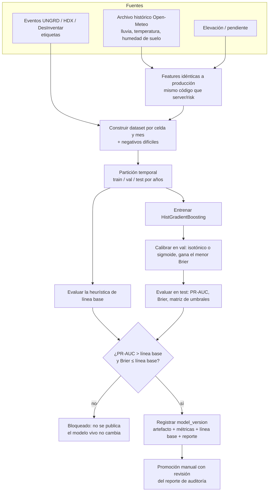

# 08 — Modelos de ML: qué se rescata y cómo se gobiernan

**Resumen:** de la v1 se rescata **el pipeline de riesgo climático y su disciplina de evaluación** (línea base, calibración, compuerta de promoción). El modelo de inundación entra como candidato. El de sequía **no**: no supera su línea base y en la v1 se promovió forzando la compuerta. El recomendador de cultivos se reformula como aptitud. El riego y el pronóstico climático no necesitan un modelo propio.

## Estado real de los modelos de la v1

Fuente: `backend/app/ml/model_metrics.json` y `docs/08-testing/resultados-validacion.md` del repositorio de la v1.

| Modelo v1 | Evidencia | Decisión en v2 |
|---|---|---|
| **Riesgo de inundación**: HistGradientBoosting calibrado (isotónico), 25 features, 16.269 muestras | PR-AUC test **0,654** vs. heurística 0,407 (+61 %). Brier 0,177. **Recall con precisión 0,9: 3,7 %** | **Rescatar como candidato.** Reentrenar con features de producción (ver paridad). Usarlo en alertas solo con severidad ≥ `alto` y el umbral elegido de la matriz precisión/recall. |
| **Riesgo de sequía**: mismo pipeline, 773 muestras | PR-AUC test **0,490 < heurística 0,529**. Recall con precisión 0,9: 0 %. `promotion_reason`: *"forced (force_promote=True): does NOT beat heuristic baseline"* | **No rescatar el artefacto.** En producción queda la heurística más la humedad de suelo medida. Se reentrena cuando haya más eventos etiquetados. |
| **Recomendador de cultivos**: HistGradientBoosting sobre datos sintéticos más EVA | Top-1 real **7,08 %** (84,6 % en sintético); Maíz 0 % con 4.405 registros | **Reformular** como aptitud ([ADR-0011](adr/0011-aptitud-de-cultivo.md)). Se rescatan el catálogo, los perfiles reales y la ingesta EVA. |
| **Pronóstico climático LSTM** (`lstm_forecaster.keras`) | Sin evaluación publicada contra un pronóstico de referencia | **No rescatar.** Se usa el pronóstico de Open-Meteo. |
| **Riego** (`irrigation_service.py`) | `ET0_BASE` es una **constante por cultivo** (por ejemplo, Maíz 5,2 mm/día), no un cálculo Penman-Monteith | **Reemplazar** por FAO-56 con ET0 diaria real ([ADR-0009](adr/0009-riego-fao56.md)). Se rescatan los umbrales de estrés por cultivo como punto de partida. |

**Qué código se lleva a `ml/`:** `riesgo_climatico_dataset.py` (construcción del dataset y negativos difíciles), `riesgo_climatico_metrics.py` (`decide_promotion`, calibración, matriz de umbrales, severidad), `riesgo_climatico_audit.py` y sus tests (`test_riesgo_metrics.py`, `test_riesgo_negatives.py`, `test_riesgo_audit.py`), y las fuentes de datos (`data_sources/ungrd.py`, `eventos_historicos.py`, `chirps.py`, `era5.py`).

## Pipeline de entrenamiento

## Reglas de gobierno

| Regla | Cómo se cumple |
|---|---|
| **Sin `force_promote`** | La opción se elimina. Un modelo que no supera su línea base no se publica. Si el negocio necesita algo, se usa la heurística, que es explicable. |
| **Compuerta doble** | PR-AUC mayor que la línea base **y** Brier menor o igual. Un modelo más discriminante pero peor calibrado da probabilidades engañosas. |
| **Partición temporal** | Test con años posteriores a train. Nunca una partición aleatoria en series climáticas (fuga de información). |
| **Paridad de features** | Las features se calculan con **un solo módulo** (`server/src/techcamp/risk/features.py`) que `ml/` importa. Las fuentes de entrenamiento son las mismas de producción (archivo histórico de Open-Meteo). |
| **Trazabilidad** | Cada `risk_prediction` guarda `model_version_id`. Cada `model_version` guarda métricas, línea base, hash del dataset y commit. |
| **Umbral operativo explícito** | La severidad `alto` usa el umbral de la matriz que da precisión ≥ 0,7. El recall en ese punto se publica en el tablero de calidad ([11-metricas](11-metricas.md)). |
| **Reversión** | Promover es cambiar `promoted` en la base. Revertir es promover la versión anterior; los artefactos no se borran. |
| **Monitoreo** | Mensualmente se comparan las alertas de riesgo con los eventos confirmados (anticipación, precisión). Si el modelo cae por debajo de la línea base dos meses seguidos, se degrada a la heurística. |

## Aptitud de cultivo (diferido a v2.x)

La v1 entrenó un clasificador para predecir **qué cultivo hay** en un lugar según los datos EVA. EVA registra lo que el productor **siembra** (costumbre, mercado, acceso a crédito), no lo que es **óptimo**. Por eso el modelo aprendió patrones que no sirven para recomendar.

En la v2 la aptitud responde otra pregunta: *"si siembro el cultivo C en esta parcela, ¿qué tan bien le va a ir?"*

| Componente | Método |
|---|---|
| Restricciones duras | Reglas agronómicas: rangos de pH, textura, drenaje y altitud. Excluyen cultivos inviables. |
| Score de aptitud | Regresión del **rendimiento relativo** (rendimiento / mediana municipal del cultivo) con EVA más las cosechas registradas en la bitácora de la v2 |
| Validación | Correlación de Spearman entre el score y el rendimiento real de las cosechas de la v2; debe superar a la media municipal como predictor |
| Presentación | Ranking con explicación por factor, nunca "el cultivo correcto" |

Hasta que haya cosechas registradas suficientes, la interfaz solo muestra las restricciones duras (reglas explicables).
