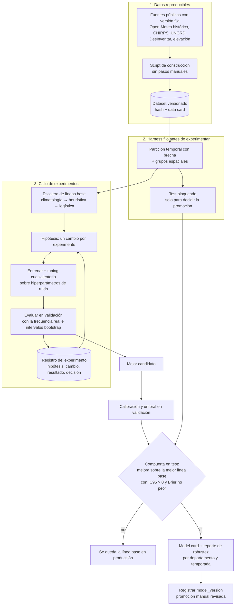

# 08 — Modelos de ML: reconstrucción desde cero y gobierno

**Resumen:** los modelos de la v1 **no se pueden rescatar**. Sus datasets procesados y artefactos entrenados vivían en otra máquina y se perdieron, así que sus métricas no se pueden reproducir. Además, la auditoría del código encontró fallas de método (fuga de datos, sin tuning, sin líneas base triviales).

La v2 reconstruye cada modelo **desde fuentes públicas reproducibles**, con un protocolo de experimentación fijo ([ADR-0020](adr/0020-protocolo-de-experimentacion-ml.md)). De la v1 se reutiliza solo **código revisado** y lo aprendido ([ADR-0019](adr/0019-reconstruccion-de-modelos.md)).

El criterio para decidir qué modelos construir es la **tecnificación**: un modelo se construye solo si mejora una decisión concreta del productor (regar, proteger, sembrar, cosechar) frente a una regla simple.

## Auditoría de la v1

Auditoría del código del repositorio de la v1 (`backend/app/ml/`), hecha el 2026-09-22.

| Modelo v1 | Métrica reportada | Hallazgos | Veredicto |
|---|---|---|---|
| **Riesgo de inundación** (HistGradientBoosting) | PR-AUC 0,654 vs. heurística 0,407 | Hiperparámetros fijos, sin búsqueda (`riesgo_climatico_model.py:112-122`). Partición solo temporal: el mismo departamento en train y test. Los negativos difíciles (±24 meses de un positivo) no respetan el corte entre particiones (`riesgo_climatico_dataset.py:201-209`): fuga. Negativos muestreados 3:1: el PR-AUC se midió con ~28 % de positivos, no con la frecuencia real. El modelo final se entrenó solo con train (`X_trainval` sin uso). Unidad espacial gruesa: centroide del departamento. | **No reproducible y con fuga.** La métrica no dice cómo se comportaría en producción. |
| **Riesgo de sequía** | PR-AUC 0,490 < heurística 0,529 | Todo lo anterior, más 773 muestras con 12 positivos en validación, y se promovió con `force_promote=True` | **No sirve.** |
| **Recomendador de cultivos** | 99 % en sintético; **7,08 %** top-1 real | Datos sintéticos; partición aleatoria; filas reales duplicadas 10× **antes** de partir (`training.py:1000-1008`): copias en train y test. Sin línea base. Responde la pregunta equivocada (qué se siembra, no qué rinde). | **No sirve.** Se reformula ([ADR-0011](adr/0011-aptitud-de-cultivo.md)). |
| **Pronóstico climático LSTM** | Solo RMSE | Sin comparación con persistencia ni climatología (`lstm_forecaster.py:251-277`); métricas fuera de `model_metrics.json` | **Sin evidencia de valor.** Se usa Open-Meteo. |
| **Riego** | — | `ET0_BASE` es una constante por cultivo (`irrigation_service.py`) | **Se reemplaza** por FAO-56 ([ADR-0009](adr/0009-riego-fao56.md)). |

## Qué se reutiliza de la v1

| Pieza | Uso en v2 | Condición |
|---|---|---|
| Descargadores `data_sources/chirps.py`, `era5.py`, `ungrd.py`, `eventos_historicos.py`, `elevation.py` | Construcción reproducible de datasets | Quitar rutas locales fijas y fijar versiones de las fuentes |
| `decide_promotion`, selección de calibración en validación, matriz de umbrales (`riesgo_climatico_metrics.py`) | Compuerta de promoción y umbrales operativos | Sin `force_promote`; la compuerta pasa a usar intervalos de confianza |
| Climatología calculada solo con el período de train (`lstm_forecaster.py:92-101`) | Patrón para líneas base y anomalías | — |
| Datos de este repositorio: EVA (26.402 filas), suelos AGROSAVIA (13.762), foliar (1.756), perfiles de cultivo | Aptitud, restricciones de suelo, línea base de rendimiento municipal | Revisar licencia y normalizar nombres de cultivos |

Todo se copia con sus tests y el commit indica el archivo de origen ([ADR-0001](adr/0001-nuevo-repositorio-v2.md)).

## Inventario de modelos de la v2

Para cada decisión del productor, primero se usa la regla más simple y solo se construye un modelo si le gana.

| # | Decisión que mejora | Arranca con (sin ML) | Modelo candidato | Etiqueta / objetivo | Línea base trivial | Métrica principal | Cuándo |
|---|---|---|---|---|---|---|---|
| M1 | **¿Riego hoy y cuánto?** | FAO-56 + sensor ([ADR-0009](adr/0009-riego-fao56.md)) | Corrección del balance por parcela: aprende el residuo entre la humedad que predice FAO-56 y la medida | Humedad de suelo medida al día siguiente | Balance FAO-56 sin corrección | MAE de humedad (% volumétrico) | Cuando haya ≥ 1 ciclo de datos de sensor por parcela |
| M2 | **¿Me preparo para inundación este mes?** | Heurística de lluvia acumulada | Clasificador de riesgo (escalera de [ADR-0020](adr/0020-protocolo-de-experimentacion-ml.md)) | Evento reportado en el municipio y el mes (UNGRD / DesInventar) | Climatología: frecuencia histórica del evento por municipio y mes | PR-AUC con la frecuencia real + Brier | E10 |
| M3 | **¿Viene sequía?** | Índice SPI-3 de lluvia + humedad de suelo medida | Igual que M2 si hay eventos suficientes. Variable **candidata**: estado ENSO del boletín agroclimático (brecha G08 de la [investigación](investigacion/tecnificacion-campo.md#4-matriz-de-brechas)); entra solo si mejora la validación | Evento de sequía reportado | Climatología + SPI | Igual que M2 | E10; solo si el conteo de positivos lo permite |
| M4 | **¿Aplico preventivo para hongos?** | Regla de humedad relativa y temperatura (`fungal_risk`) | Clasificador con observaciones de la bitácora | Brote confirmado en la bitácora (observación con foto) | La regla actual | Precisión y recall de la alerta | v2.x, cuando la bitácora acumule brotes etiquetados |
| M5 | **¿El sensor está fallando?** | Reglas de calidad (rango, varianza cero, saltos) | Detector de anomalías por sensor | Fallas confirmadas por el técnico | Reglas de calidad | Precisión de las alertas `sensor_suspect` | v2.x |
| M6 | **¿Qué siembro?** | Restricciones duras de suelo | Aptitud por rendimiento relativo ([ADR-0011](adr/0011-aptitud-de-cultivo.md)) | Rendimiento / mediana municipal | Mediana municipal del cultivo | Spearman con el rendimiento real | v2.x |
| — | Pronóstico climático | Open-Meteo | **Ninguno propio** | — | — | — | No se construye |

**Orden:** M2 es el único modelo previsto antes del piloto. M1, M4 y M5 dependen de datos que **solo produce la v2** (sensores y bitácora): así la tecnificación genera los datos que mejoran los modelos.

## M2: riesgo de inundación

| Aspecto | Decisión |
|---|---|
| Unidad | **Municipio × mes** (la v1 usaba el centroide del departamento). El clima de cada municipio se consulta en su cabecera (D-T3.1), no en un centroide; los valores diarios salen de la grilla de ERA5 que contiene ese punto. |
| Etiqueta | 1 si hay un evento de inundación reportado en el municipio y el mes. Se documenta el sesgo de reporte: los municipios más accesibles reportan más. |
| Negativos | **Todos** los municipio-mes sin evento. Sin submuestreo en validación ni test; en train solo se permite pesar clases. |
| Features | Solo información disponible al emitir la predicción: lluvia acumulada de 1 a 6 meses, anomalías contra la climatología de train, humedad de suelo, pendiente y elevación, estacionalidad. Se calculan con el mismo módulo en `ml/` y `server/` (`risk/features.py`) y la misma fuente que en producción (archivo histórico de Open-Meteo). |
| Partición | Temporal con **brecha ≥ 6 meses** (la ventana más larga de las features) entre train, val y test. Reporte adicional dejando fuera un departamento a la vez. |
| Escalera | Climatología → heurística → regresión logística → LightGBM → TabPFN (si la licencia y el tamaño lo permiten) → ensamble solo si mejora con intervalo de confianza. |
| Uso operativo | Severidad `alto` con el umbral que da precisión ≥ 0,7 en validación. El recall en ese punto se publica. |
| Región | Los 7 departamentos del Caribe continental: Atlántico (08), Bolívar (13), Cesar (20), Córdoba (23), La Guajira (44), Magdalena (47) y Sucre (70): **195 municipios** en el MGN 2024 del DANE. San Andrés queda fuera (insular). |
| Horizonte | La predicción del mes M se emite con datos **hasta el último día de M−1**; la etiqueta es el evento en M. `horizon_start` es el día 1 de M y `horizon_days` los días de M. |
| Severidad | `alto`: probabilidad ≥ el umbral que da precisión ≥ 0,7 en validación. `crítico`: ≥ el umbral que da precisión ≥ 0,85, solo si existe. `bajo`: el resto. Códigos: `low`, `high`, `critical`. Los umbrales viajan con la versión del modelo (`model_version.thresholds`). |
| Factores | `top_factors`: las 3 features con mayor contribución a la predicción (contribuciones del árbol en LightGBM, coeficiente × valor estandarizado en la logística, las entradas de la regla en la heurística), con su valor. |
| Línea base servida | Si ningún modelo pasa la compuerta, se sirve la **mejor línea base de la validación** (climatología o heurística calibrada). Las líneas base también se registran en `model_version` (`is_baseline`), así que toda `risk_prediction` tiene `model_version_id`. |
| Limitación (model card) | M2 solo ve la lluvia local. **No modela la inundación fluvial ni la ruptura de diques**, que son el motor principal del riesgo en las zonas bajas (La Mojana, Sinú, San Jorge): por ejemplo, la ruptura del dique de Cara de Gato sobre el río Cauca en 2021. En un piloto, las alertas hidrológicas del IDEAM por río entran primero como regla de línea base, antes que M2 (brecha G07 de la [investigación](investigacion/tecnificacion-campo.md#4-matriz-de-brechas)). |

### Fuentes de datos de M2

Verificadas el 2026-10-02 (E10, D-T0.1). Cada descarga guarda la respuesta cruda, la fecha y su hash; el dataset se arma solo desde esas copias.

| Dato | Fuente | Detalle |
|---|---|---|
| Etiquetas | UNGRD, consolidado de emergencias en datos.gov.co: `wwkg-r6te` (2019–2022, CC BY-SA 4.0), `rgre-6ak4` (2023–2024, CC BY-SA 4.0), `2343-nuqp` (2025 en adelante, CC BY 4.0) | Eventos `INUNDACION`, `CRECIENTE SUBITA` y `AVENIDA TORRENCIAL`, normalizando mayúsculas y tildes. Cada año trae columnas distintas: un mapeo por dataset. El código DIVIPOLA de `wwkg-r6te` es numérico y pierde el cero inicial: se rellena a 5 dígitos. |
| Etiquetas antes de 2019 | Consolidados anuales de la UNGRD (1998–2021, repositorio de la UNGRD); respaldo: exportación de DesInventar Colombia | Entran solo si su formato permite el mismo mapeo por municipio y día. Se unen con un **año de corte fijo**, nunca mezclando fuentes dentro de un año; sin ellos el dataset empieza en 2019. |
| Municipios | DANE, DIVIPOLA (datos.gov.co `gdxc-w37w`) para el punto: la **cabecera municipal**; DANE MGN 2024, capa Municipio 317 (`mpio_cdpmp` = DIVIPOLA de 5 dígitos) como control | La capa 317 de MGN 2024 devuelve `geometry: null`, así que no hay centroide que calcular: el punto donde se consulta el clima de entrenamiento es la cabecera. MGN 2024 queda como control del conjunto de códigos: los 195 municipios de la región tienen que coincidir con el DIVIPOLA o la construcción falla (D-T3.1, E10 T3). |
| Clima | Open-Meteo, archivo histórico, `models=era5` **fijo** (nunca `best_match`) | `precipitation_sum` y `soil_moisture_0_to_7cm_mean` diarios. ERA5-Land no devuelve precipitación en Open-Meteo. ERA5 llega con ~5 días de retraso. |
| Elevación y pendiente | Open-Meteo, API de elevación (Copernicus GLO-90) | Elevación en el punto; pendiente por diferencias finitas con 4 vecinos a ~1 km. |

CHIRPS no es feature (rompería la paridad de fuente); sirve solo para un chequeo fuera de línea de qué tan bien capta ERA5 la lluvia del Caribe. TabPFN entra a la escalera solo con los pesos de TabPFN-2 (Prior Labs License); los de 2.5 en adelante no permiten uso comercial. Open-Meteo gratuito es de uso no comercial: cubre el seminario ([ADR-0021](adr/0021-perfil-seminario-local.md)); producción necesita su plan de pago.

### Estructura de `ml/`

Proyecto propio (`ml/pyproject.toml`) que depende del paquete del `server`: las features se importan de `techcamp.risk.domain.features`, el mismo módulo que usa la inferencia (paridad).

| Ruta | Contenido | Dueño |
|---|---|---|
| `ml/models/flood_m2/card.md` | Model card (paso 1 del [ADR-0020](adr/0020-protocolo-de-experimentacion-ml.md)) | — |
| `ml/src/techcamp_ml/sources/` | Descargadores con caché local: cada respuesta cruda en `ml/.cache/raw/<fuente>/` con su URL, fecha y `sha256` en `ml/.cache/raw/MANIFEST.tsv`, y los parquets ya parseados en `ml/data/flood_m2/sources/` (ambos fuera de git) | — |
| `ml/datasets/flood_m2/` | Script de construcción, data card y manifiesto con el hash | — |
| `ml/harness/` y `ml/src/techcamp_ml/harness/` | Manifiesto `LOCK.sha256` (en el primero) y el código: partición, métricas con IC95, test bloqueado y compuerta (`decide_promotion`), con sus tests. El manifiesto cubre los dos directorios, incluido el verificador | Humano: `CODEOWNERS` + test de hash ([#192](https://github.com/jab16jy/techcamp-v2/issues/192)) |
| `ml/experiments/` | `log.csv` y una nota por experimento | — |

El primer harness lo redacta un agente y el dueño lo aprueba antes de cualquier experimento; desde ahí queda congelado (owner, 2026-10-02). Datasets y artefactos van al bucket `ml` de MinIO ([ADR-0018](adr/0018-almacenamiento-de-objetos.md)), con prefijos `datasets/<nombre>/<hash>/` y `models/<nombre>/<versión>/`.

## Pipeline de entrenamiento

## Reglas de gobierno

| Regla | Cómo se cumple |
|---|---|
| **Reproducible o no existe** | Dataset y modelo se regeneran desde cero con un comando; se versionan el hash del dataset, el commit y la semilla. Artefactos y datasets van al almacenamiento de objetos ([ADR-0018](adr/0018-almacenamiento-de-objetos.md)), no a una sola máquina. |
| **Sin `force_promote`** | No existe la opción. Si ningún modelo le gana a la línea base, en producción queda la línea base, que es explicable. |
| **Compuerta estadística** | La mejora sobre la **mejor** línea base debe tener IC95 por bootstrap pareado con límite inferior > 0, y el Brier no puede empeorar. |
| **Test intocable** | El test se usa una vez por candidato final. Iterar mirando el test es fuga. |
| **Frecuencia real** | Validación y test tienen la frecuencia real de la clase. El submuestreo solo existe dentro de train. |
| **Paridad de features** | Un solo módulo de features para `ml/` y `server/`, con la misma fuente de datos en los dos lados. |
| **Trazabilidad** | Cada `risk_prediction` guarda `model_version_id`; cada `model_version` guarda métricas, líneas base, hash del dataset y commit. |
| **Reversión** | Promover es cambiar `promoted` en la base; revertir es promover la versión anterior. Los artefactos no se borran. |
| **Monitoreo** | Cada mes se comparan las alertas con los eventos confirmados. Si el modelo queda por debajo de la línea base dos meses seguidos, se vuelve a la línea base. |

## Aptitud de cultivo (diferido a v2.x)

La v1 entrenó un clasificador para predecir **qué cultivo hay** en un lugar según EVA. EVA registra lo que el productor **siembra** (costumbre, mercado, crédito), no lo que es **óptimo**, así que el modelo aprendió patrones que no sirven para recomendar.

En la v2 la aptitud responde otra pregunta: *"si siembro el cultivo C en esta parcela, ¿qué tan bien le va a ir?"*

| Componente | Método |
|---|---|
| Restricciones duras | Reglas agronómicas: rangos de pH, textura, drenaje y altitud. Excluyen cultivos inviables. |
| Score de aptitud | Regresión del **rendimiento relativo** (rendimiento / mediana municipal del cultivo) con EVA más las cosechas de la bitácora de la v2 |
| Validación | Spearman entre el score y el rendimiento real; debe superar a la mediana municipal como predictor |
| Presentación | Ranking con explicación por factor, nunca "el cultivo correcto" |

Hasta que haya cosechas suficientes, la interfaz solo muestra las restricciones duras.
