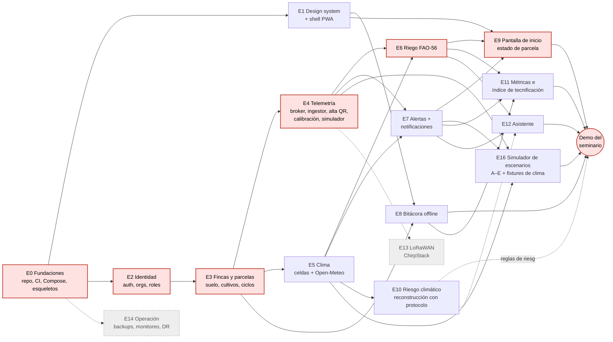
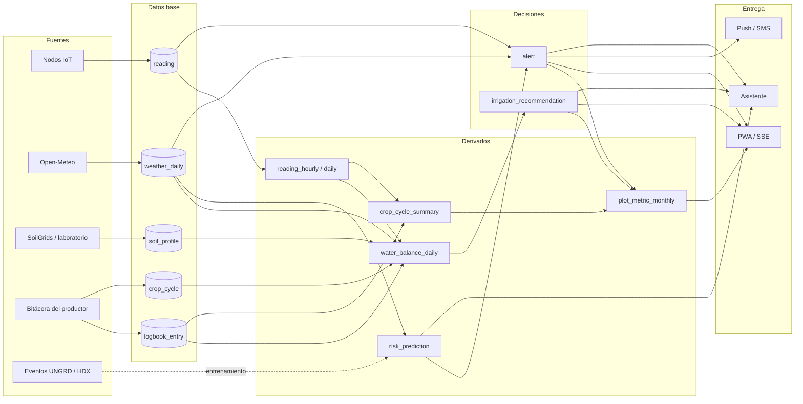
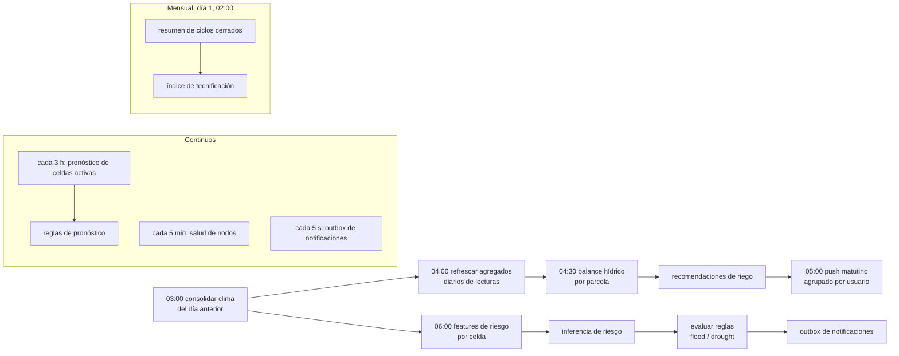

# 10 — DAGs

Tres grafos acíclicos dirigidos: el orden de **construcción**, el flujo de **datos** en ejecución y la **orquestación** de jobs. El DAG de entrenamiento de modelos está en [08-ml](08-ml.md#pipeline-de-entrenamiento).

## 1. DAG de implementación (épicas)

Una flecha `A → B` significa que B necesita A terminada. En rojo, la **ruta crítica** a la demo del seminario. En gris punteado, lo que queda para **producción futura** ([ADR-0021](adr/0021-perfil-seminario-local.md)).

| Épica | Resultado verificable | Depende de |
|---|---|---|
| E0 | `docker compose --profile seminar up` levanta Postgres (con sus 3 extensiones), Mosquitto, MinIO, api y web vacíos; CI verde con lint, tipos, tests e import-linter | — |
| E1 | Tokens, primitivos y el catálogo `/dev/ui`; PWA instalable que abre offline | E0 |
| E2 | Ingreso por OTP con el emisor local de JWT (código en consola), `GET /me`, membresías y roles, test de aislamiento entre organizaciones | E0 |
| E3 | Crear finca y parcela dibujando el polígono; autocompletado de suelo; catálogo de cultivos con Kc | E2 |
| E4 | Un **simulador de nodo básico** publica y las lecturas aparecen calibradas en la base y en vivo (SSE) | E3 |
| E5 | ET0, lluvia y pronóstico por celda con degradación `stale` | E3 |
| E6 | Recomendación diaria con `rationale`, con lámina en parcelas con riego y recomendación de secano en las demás; test con los ejemplos numéricos de FAO-56 | E4, E5 |
| E7 | El escenario A dispara una alerta y llega un push (y el SMS simulado a `/dev/outbox`); reintentos y escalamiento probados. Las reglas `flood_risk`/`drought_risk` se activan cuando termina E10 | E4, E5 |
| E8 | El escenario D (cosecha en modo avión) sincroniza sin duplicar | E1, E3 |
| E9 | Pantalla de inicio completa con datos reales del simulador | E1, E6, E7 |
| E10 | Model card, dataset reproducible, harness y escalera de líneas base de M2 (inundación); en producción queda el modelo que pase la compuerta o, si ninguno pasa, la línea base ([ADR-0020](adr/0020-protocolo-de-experimentacion-ml.md)) | E5 |
| E11 | Índice de tecnificación mensual y resumen por ciclo | E6, E7, E8 |
| E12 | Asistente con fuentes citadas, límites y degradación | E6, E7, E10 |
| E16 | Los escenarios A–E corren con un comando, con fixtures de clima grabados, y su bloque `expected` pasa como prueba end-to-end en CI ([06 §10](06-diseno-detallado.md#10-simulador-de-escenarios-perfil-seminario)) | E4, E5, E7 |
| E13 *(producción futura)* | Un nodo LoRa real llega por ChirpStack con el mismo mensaje interno | E4 |
| E14 *(producción futura)* | Backup y restauración ensayados; tableros de SLO | E0 |

**Paralelismo:** después de E3 se pueden trabajar en paralelo E4, E5 y E8. E1 corre en paralelo a E2 y E3 desde el inicio. E10 (reconstrucción del modelo) no bloquea la ruta crítica: la demo puede mostrar alertas de umbral y pronóstico, y sumar las de riesgo si el modelo pasa la compuerta a tiempo. E12 usa las predicciones de riesgo si existen, pero no depende de ellas.

## 2. DAG de datos en ejecución

La bitácora alimenta el balance hídrico (riegos registrados) y el resumen del ciclo (cosechas y costos). Sin bitácora no hay métricas de impacto.

## 3. DAG de orquestación diaria (worker)

Horas en `America/Bogota`. Cada job arranca cuando termina el anterior y además tiene hora mínima de inicio; si una dependencia falla, los siguientes no corren y se alerta al equipo.

