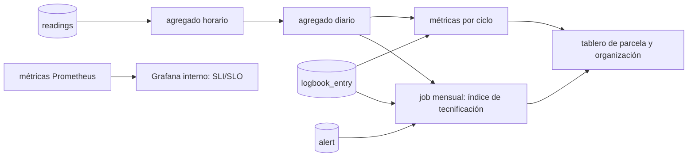

# 11 — Métricas de tecnificación

Tecnificar significa que la parcela **produce más con menos agua y menos riesgo**, y que el productor **decide con datos**. Estas métricas lo demuestran. Cada una tiene fórmula, fuente y frecuencia, y se calcula con datos que el sistema ya captura: sensores, bitácora y alertas.

> **En el seminario** las métricas se calculan sobre datos del simulador: demuestran que el cálculo y el tablero funcionan, no el impacto real. La línea base y la comparación con EVA quedan listas para un piloto con productores.

Hay cinco grupos:

| Grupo | Pregunta que responde | Audiencia |
|---|---|---|
| 1. Impacto | ¿Mejoró la producción? | Productor, organización, financiadores |
| 2. Adopción | ¿Se está usando la tecnología? | Organización, equipo |
| 3. Calidad de decisión | ¿Las recomendaciones y los modelos aciertan? | Equipo, investigadores |
| 4. Operación (SLI/SLO) | ¿El sistema funciona? | Equipo |
| 5. Producto | ¿La app aporta valor? | Equipo |

## 1. Impacto (por ciclo de cultivo y agregado por organización)

| Métrica | Fórmula | Fuente | Frecuencia |
|---|---|---|---|
| **Rendimiento** | `Σ kg cosechados / área_ha` | Bitácora (`harvest`) | Por ciclo |
| **Brecha de rendimiento** | `(rendimiento − rendimiento_EVA_municipio) / rendimiento_EVA_municipio` | Bitácora + EVA (promedio de 3 años del cultivo en el municipio) | Por ciclo |
| **Agua aplicada** | `Σ mm de riego × 10` → m³/ha | Bitácora (`irrigation`) o caudalímetro | Por ciclo |
| **Productividad del agua (WUE)** | `kg cosechados / m³ aplicados` | Bitácora | Por ciclo |
| **Días en estrés hídrico** | Días con humedad de suelo media < umbral del cultivo | Agregado diario de lecturas | Por ciclo |
| **Costo por hectárea** | `Σ costos / área_ha` | Bitácora (`cost` en labores e insumos) | Por ciclo |
| **Costo por kg** | `Σ costos / kg cosechados` | Bitácora | Por ciclo |
| **Margen bruto** | `kg × precio_venta − Σ costos` | Bitácora (precio registrado en la cosecha) | Por ciclo |
| **Pérdidas por evento** | kg o COP perdidos reportados en observaciones ligadas a alertas | Bitácora | Por evento |

**Línea base.** Al inscribir una parcela se registra una encuesta corta: rendimiento del último ciclo, costos aproximados y forma de riego. Sin línea base no hay forma de mostrar impacto. Si el programa lo permite, se comparan también contra parcelas de control del mismo municipio que no tienen sensores.

## 2. Adopción: índice de tecnificación

Es un índice de 0 a 100 por parcela, calculado cada mes con cuatro componentes de igual peso:

```
technification_index = 25 × monitoring + 25 × record_keeping + 25 × decision + 25 × risk_management
```

| Componente | Fórmula (0–1) | Qué significa |
|---|---|---|
| `monitoring` | `lecturas recibidas / lecturas esperadas` en el mes (tope 1) | La parcela se está midiendo |
| `record_keeping` | `semanas con ≥ 1 entrada de bitácora / semanas del mes` | El productor registra lo que hace |
| `decision` | `días con recomendación seguida / días con recomendación`. Seguida = lámina aplicada dentro de ±25 % de la recomendada, o no regar cuando la recomendación fue 0 | Las decisiones usan los datos |
| `risk_management` | `alertas reconocidas a tiempo / alertas abiertas`. A tiempo = 2 h para críticas, 24 h para el resto | Las alertas llegan y se atienden |

Los pesos son fijos en v2.0 y se revisan con los datos del piloto.

Otras métricas de adopción:

| Métrica | Fórmula |
|---|---|
| Parcelas monitoreadas | `parcelas con nodo activo / parcelas` |
| Ciclos cerrados con cosecha | `ciclos con cosecha registrada / ciclos terminados` |
| Tiempo a primera lectura | Horas entre el alta del nodo y su primera lectura válida |

## 3. Calidad de decisión

| Métrica | Fórmula | Umbral para producción |
|---|---|---|
| **Riesgo: PR-AUC** | Área bajo la curva precisión-recall en el test temporal | > PR-AUC de la línea base heurística |
| **Riesgo: Brier score** | Error cuadrático medio de la probabilidad | < Brier de la línea base |
| **Riesgo: recall a la precisión operativa** | Recall con el umbral que da precisión ≥ 0,7 | Se reporta siempre |
| **Anticipación de alertas** | Horas entre la alerta y el evento confirmado | Mediana ≥ 24 h en riesgo climático |
| **Precisión de alertas** | `alertas con evento confirmado / alertas` | Se reporta por regla |
| **Riego: error de humedad** | MAE entre la humedad de suelo que predice el balance y la medida al día siguiente | < 5 puntos de % volumétrico |
| **Aptitud (diferido)** | Correlación de Spearman entre el score de aptitud y el rendimiento real | > 0 con significancia; se compara contra la media municipal |

Estado de los modelos de la v1: ver [08-ml](08-ml.md).

## 4. Operación (SLI → SLO)

| SLI | Medición | SLO |
|---|---|---|
| Disponibilidad de la API | `respuestas no 5xx / respuestas` | 99,5 % mensual |
| Latencia de la API | p95 de las lecturas | < 300 ms |
| Completitud de datos | `lecturas recibidas / esperadas` por nodo y día | ≥ 95 % para nodos en línea |
| Latencia de ingesta | p95 de `received_at − time` al llegar en vivo | < 60 s |
| Latencia de alerta | p95 entre la lectura y el envío de la notificación | < 2 min para críticas |
| Nodos en línea | `nodos con lectura en la última hora / nodos activos` | ≥ 90 % |
| Éxito de sincronización | `lotes de sincronización aceptados / enviados` | ≥ 99 % |
| Entrega de notificaciones | `enviadas con éxito / intentadas` | ≥ 98 % |
| Presupuesto de LLM | `gasto del mes / tope` | < 100 % (al llegar al tope se degrada) |

## 5. Producto

| Métrica | Fórmula |
|---|---|
| Usuarios activos semanales | Usuarios con ≥ 1 sesión en 7 días |
| Retención a 30 días | Usuarios activos el día 30 / usuarios registrados ese día |
| Uso offline | `entradas de bitácora creadas sin conexión / entradas` |
| Utilidad del asistente | `respuestas marcadas como útiles / respuestas calificadas` |

## Dónde se calculan



Las métricas de impacto y adopción se guardan en `plot_metric_monthly` y `crop_cycle_summary` ([03-modelo-datos](03-modelo-datos.md)) para que el tablero no las recalcule en cada consulta.
