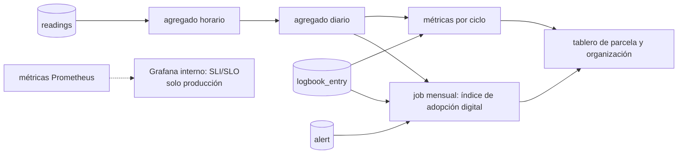

# 11 — Métricas de tecnificación

Tecnificar significa que la parcela **produce más con menos agua y menos riesgo**, y que el productor **decide con datos**. Estas métricas lo demuestran. Cada una tiene fórmula, fuente y frecuencia, y se calcula con datos que el sistema ya captura: sensores, bitácora y alertas.

> **En el seminario** las métricas se calculan sobre datos del simulador: demuestran que el cálculo y el tablero funcionan, no el impacto real. La encuesta de inscripción y la comparación con EVA quedan listas para un piloto con productores.

Hay cinco grupos:

| Grupo | Pregunta que responde | Audiencia |
|---|---|---|
| 1. Impacto | ¿Mejoró la producción? | Productor, organización, financiadores |
| 2. Adopción | ¿Se está usando la tecnología? | Organización, equipo |
| 3. Calidad de decisión | ¿Las recomendaciones y los modelos aciertan? | Equipo, investigadores |
| 4. Operación (SLI/SLO) | ¿El sistema funciona? | Equipo |
| 5. Producto | ¿La app aporta valor? | Equipo |

## 1. Impacto (por ciclo de cultivo y agregado por organización)

| Métrica | Fórmula | Fuente | Frecuencia |
|---|---|---|---|
| **Rendimiento** | `Σ yield_kg / área_ha` | Bitácora (`harvest`) | Por ciclo |
| **Cambio de rendimiento frente a la encuesta de inscripción** | `(rendimiento − last_yield_kg_ha) / last_yield_kg_ha`, solo si el cultivo es el mismo | Bitácora + `plot_baseline` | Por ciclo |
| **Rendimiento relativo municipal** (`relative_yield`) | `rendimiento / mediana_EVA(cultivo, municipio, 3 años)`. Ubica la parcela frente a la referencia municipal; **no mide impacto** | Bitácora + EVA (`field_record`) | Por ciclo |
| **Agua aplicada** | `Σ mm de riego × 10` → m³/ha. Solo parcelas con riego | Bitácora (`irrigation`) o caudalímetro | Por ciclo |
| **Productividad del agua de riego (WUE)** | `kg cosechados / m³ aplicados`. Solo parcelas con riego | Bitácora | Por ciclo |
| **Días en estrés hídrico** | Días con Ks < 1, es decir, `depletion_mm > raw_mm` ([ADR-0022](adr/0022-estres-hidrico-y-asimilacion.md)). Aplica con riego y en secano | `water_balance_daily` (balance asimilado) | Por ciclo |
| **Costo por hectárea** | `Σ costos / área_ha`, con `Σ costos = Σ cost_cop` de `task`, `input` y `cost` | Bitácora | Por ciclo |
| **Costo por kg** | `Σ costos / Σ yield_kg` | Bitácora | Por ciclo |
| **Producción por jornal** | `Σ yield_kg / Σ labor_days` (aproximación al ODS 2.3.1, producción por día de trabajo) | Bitácora (`task`) | Por ciclo |
| **Margen bruto** | `Σ (sold_kg × sale_price_cop_per_kg) − Σ costos` | Bitácora (venta registrada en la cosecha) | Por ciclo |
| **Pérdidas por evento** | `Σ quantity` (kg) y `Σ cost_cop` (COP) de las observaciones con `alert_id` | Bitácora | Por evento |

**Parcelas de secano** (`irrigation_system = none`, [ADR-0023](adr/0023-parcelas-con-riego-y-secano.md); brecha G06 de la [investigación](investigacion/tecnificacion-campo.md#4-matriz-de-brechas)). No tienen agua aplicada ni productividad del agua de riego: su resultado hídrico se reporta con el rendimiento y los días en estrés hídrico.

**Encuesta de inscripción** (`plot_baseline`). Al inscribir una parcela se registra una encuesta corta: cultivo y rendimiento del último ciclo, costos aproximados y práctica de riego ([03](03-modelo-datos.md#plot_baseline-encuesta-de-inscripción)). El impacto se mide contra esa encuesta (antes y después por parcela) y, en un piloto, contra parcelas de control del mismo municipio sin TechCamp (diferencias en diferencias). No se mide contra la media municipal: los productores que adoptan se autoseleccionan y EVA no es una muestra comparable, así que el rendimiento relativo municipal solo da contexto (brechas G04 y G11 de la [investigación](investigacion/tecnificacion-campo.md#4-matriz-de-brechas); [ADR-0024](adr/0024-metricas-de-impacto-y-adopcion-digital.md)).

## 2. Adopción: índice de adopción digital

Es un índice de 0 a 100 por parcela, calculado cada mes con cuatro componentes que pesan lo mismo entre sí. Mide el **uso de la plataforma**, no la tecnificación en sí (brecha G05 de la [investigación](investigacion/tecnificacion-campo.md#4-matriz-de-brechas); [ADR-0024](adr/0024-metricas-de-impacto-y-adopcion-digital.md)).

El índice **reparte los 100 puntos entre los componentes que sí tienen evidencia**, con el mismo peso cada uno (100/4 con los cuatro, 100/3 con uno nulo, 100/2 con dos, 100 con uno):

```
con_evidencia = los componentes cuyo valor NO es null
digital_adoption_index = 100 × (Σ con_evidencia) / (cantidad de con_evidencia)
digital_adoption_index = null    si los cuatro componentes son null
```

Con los cuatro componentes presentes, `100 × (monitoring + record_keeping + decision + risk_management) / 4` es el mismo número que el promedio ponderado fijo de 25 puntos, así que los dos enunciados coinciden cuando no falta evidencia; difieren en cuanto un componente vale `null`, que es lo que fija la regla de cálculo más abajo (D-T0.3).

| Componente | Fórmula (0–1) | Qué significa |
|---|---|---|
| `monitoring` | `lecturas recibidas / lecturas esperadas` en el mes (tope 1) | La parcela se está midiendo |
| `record_keeping` | `semanas con ≥ 1 entrada de bitácora / semanas del mes` | El productor registra lo que hace |
| `decision` | `días con recomendación seguida / días con recomendación`. Seguida = lámina aplicada dentro de ±25 % de la recomendada, o no regar cuando la recomendación fue 0 | Las decisiones usan los datos |
| `risk_management` | `alertas con acción registrada a tiempo / alertas abiertas` de la parcela en el mes (las de nodo no cuentan: van al técnico). Acción = una entrada de bitácora con el `alert_id` de la alerta o, en `water_stress` de una parcela con riego, un riego registrado **en esa parcela**. A tiempo = antes de 48 h desde la apertura. Reconocer la alerta no cuenta como acción | Las alertas llevan a actuar |

En una parcela de secano `decision` no aplica (no hay lámina que seguir) y los otros tres componentes pesan 100/3 cada uno.

**Reglas de cálculo** (E11, D-T0.3 a D-T0.6):

- **Mes.** Es el mes calendario en `America/Bogota`. Un componente se calcula con los eventos de ese mes.
- **Componente sin evidencia.** Un componente sin denominador vale `null`, nunca `0` ni `1`. Pasa con `monitoring` si la parcela no tuvo nodo reclamado en el mes, con `decision` si no hubo días con recomendación que cuente o la parcela es de secano, y con `risk_management` si no se abrió ninguna alerta de parcela. El índice reparte los 100 puntos entre los componentes no nulos, con el mismo peso cada uno (la regla de secano es el caso de un solo componente nulo). Si los cuatro son `null`, el índice es `null`.
- **`monitoring`.** Lecturas esperadas por nodo = segundos en que el nodo estuvo reclamado dentro del mes (desde el mayor entre el inicio del mes y `claimed_at`) ÷ `interval_s`. Cuentan todas las lecturas recibidas, con cualquier `quality`: el componente mide que la parcela se está midiendo, y una lectura fuera de rango ya la cubren las alertas de nodo. Con varios nodos se suman las esperadas y las recibidas antes de dividir.
- **`decision`.** Cuentan los días con recomendación `irrigate`, `postpone` o `not_needed`; `no_kc` y `rainfed` no entran. Un día `irrigate` se sigue si la suma de `irrigation_mm` registrada ese día queda dentro de ±25 % de `depth_mm`. Un día `postpone` o `not_needed` se sigue si ese día no hay riego registrado.
- **`risk_management`.** El denominador son las alertas de parcela con `opened_at` dentro del mes. La bitácora registra fechas, no horas, así que "a tiempo" significa que `occurred_on` cae entre el día local de `opened_at` y el día local de `opened_at + 48 h`. Una alerta abierta en las últimas 48 h del mes se evalúa con lo registrado hasta que corre el job.
- **La acción de `water_stress` es de la parcela, no del ciclo de cultivo** (D-T3.1). El riego que responde una alerta de estrés hídrico cuenta si está registrado **en esa parcela** dentro de la ventana de 48 h, y **no lleva qualifier de ciclo**: una entrada de riego con `crop_cycle_id` nulo también cuenta, y cuenta igual si el teléfono le colgó el ciclo que tenía en caché. La acción tampoco se acota por el tipo de entrada: `alert_id` es la marca de la acción (`alert` no tiene `crop_cycle_id`, así que acotarla exigiría un cruce temporal que ningún doc define, y `crop_cycle_id` admite `null` — [03](03-modelo-datos.md#logbook_entry-la-tabla-que-se-sincroniza-offline)).

El job mensual guarda el índice y sus componentes en `plot_metric_monthly`. El resumen del ciclo se guarda en `crop_cycle_summary` cuando el ciclo termina (`harvested` o `lost`). El de un ciclo activo se calcula al consultarlo y no se guarda (D-T0.8). El cambio frente a la encuesta es `null` si `last_yield_kg_ha = 0`: una temporada perdida es un dato válido de la encuesta, pero no se puede medir un cambio porcentual contra cero (#243). `relative_yield` queda `null` hasta que exista `field_record`: los datos EVA de la v1 no se recuperaron (D-T0.9).

Los pesos son fijos en v2.0 y se revisan con los datos del piloto. Si el índice debe alinearse con la clasificación de usuarios del MADR (cinco aspectos del enfoque de extensión, niveles 1–4, Ley 1876) es una decisión abierta del dueño del producto.

Otras métricas de adopción:

| Métrica | Fórmula |
|---|---|
| Parcelas monitoreadas | `parcelas con nodo activo / parcelas` |
| Ciclos cerrados con cosecha | `ciclos con cosecha registrada / ciclos terminados` (el mes de un ciclo es el de la entrada de bitácora que registra su cierre; ver §2) |
| Tiempo a primera lectura | Horas entre el alta del nodo y su primera lectura válida |

Estas tres, junto con el promedio del índice de las parcelas con índice, forman `OrgMetrics` (`GET /organizations/{org_id}/metrics`, D-T0.12). Se calculan al consultar: cuentan sobre el mes pedido y la mediana del tiempo a primera lectura toma los nodos reclamados en ese mes, un valor por nodo y no la mediana de las medianas de parcela.

**En qué mes cuenta un ciclo** (D-T7.2). `crop_cycle` no tiene fecha de cierre ([03:128-135](03-modelo-datos.md)), así que el mes de un ciclo es el de la entrada de bitácora que **registra su cierre**, por su `occurred_on`: la fecha que escribió el productor, nunca la que llegó la sincronización offline.

- **Numerador:** ciclos con una entrada `harvest` en el mes.
- **Denominador:** ciclos con una entrada que registre el cierre en el mes y `status` en `harvested` o `lost`. Una entrada `harvest` registra el cierre de un ciclo cosechado, y una `observation` con `alert_id` registra el cierre de uno perdido (esa observación *es* el registro de la pérdida, [03:424](03-modelo-datos.md)).
- **Un ciclo `active` no cuenta ni en el numerador ni en el denominador**, aunque tenga una cosecha registrada: el denominador son ciclos **terminados**, así que la fracción es de ciclos cerrados y registrados, no de ciclos con cosecha anotada.
- **Evidencia faltante, no cero.** Un ciclo `lost` sin observación de pérdida, y un ciclo cerrado por `PATCH` sin ninguna entrada de bitácora, no aparecen en ningún mes. Un mes sin ciclos terminados vale `null`, nunca `0`.

La mediana del tiempo a primera lectura usa la lectura válida según [04:83](04-api.md): calibrada, con `value` no nulo y sin el bit de fuera de rango en `quality`. Un nodo reclamado en el mes que todavía no tiene lectura válida no aporta valor a la mediana, y no es lo mismo que aportar un cero.

## 3. Calidad de decisión

| Métrica | Fórmula | Umbral para producción |
|---|---|---|
| **Riesgo: PR-AUC** | Área bajo la curva precisión-recall en el test temporal | > PR-AUC de la línea base heurística |
| **Riesgo: Brier score** | Error cuadrático medio de la probabilidad | < Brier de la línea base |
| **Riesgo: recall a la precisión operativa** | Recall con el umbral que da precisión ≥ 0,7 | Se reporta siempre |
| **Anticipación de alertas** | Reglas de pronóstico (`heavy_rain_forecast`): horas entre la alerta y el evento observado. Modelos mensuales (M2 inundación, M3 sequía): proporción de eventos con aviso emitido antes del mes del evento, porque su unidad es municipio × mes (brecha G09) | Pronóstico: mediana ≥ 24 h. M2 y M3: se reporta siempre |
| **Precisión de alertas** | `alertas con evento confirmado / alertas` | Se reporta por regla |
| **Riego: error de humedad** | MAE entre la humedad de suelo que predice el balance y la de referencia al día siguiente. En el seminario la referencia es la verdad del simulador (la trayectoria sin ruido); en el piloto, un sensor con calibración de campo. Se reporta junto al RMSE de la calibración de ese sensor (`calibration.rmse_pct`), porque sin calibración de campo ese error es de 5,5–19 puntos (brecha G10) | < 5 puntos de % volumétrico; no se puede verificar con un sensor cuyo RMSE de calibración pase de 5 puntos |
| **Aptitud (diferido)** | Correlación de Spearman entre el score de aptitud y el rendimiento real | > 0 con significancia; se compara contra la media municipal |

Estado de los modelos de la v1: ver [08-ml](08-ml.md).

## 4. Operación (SLI → SLO)

> **Aplica al perfil `production` (futuro).** En el perfil seminario no hay monitoreo ([09](09-cuellos-de-botella.md), [ADR-0021](adr/0021-perfil-seminario-local.md)), así que estos SLO no se vigilan. Solo el tope de presupuesto del LLM (USD 5) se aplica como límite.

| SLI | Medición | SLO |
|---|---|---|
| Disponibilidad de la API | `respuestas no 5xx / respuestas` | 99,5 % mensual |
| Latencia de la API | p95 de las lecturas | < 300 ms |
| Completitud de datos | `lecturas recibidas / esperadas` por nodo y día | ≥ 95 % para nodos en línea |
| Latencia de ingesta | p95 de `received_at − time` al llegar en vivo | < 60 s |
| Latencia de alerta | p95 entre la lectura y el envío de la notificación | < 2 min para críticas |
| Nodos en línea | `nodos con lectura en la última hora / nodos activos` | ≥ 90 % |
| Éxito de sincronización | `lotes de sincronización aceptados / enviados` | ≥ 99 % |
| Entrega de notificaciones | `enviadas con éxito / intentadas` | ≥ 98 % |
| Presupuesto de LLM | `gasto del mes / tope` | < 100 % (al llegar al tope se degrada) |

## 5. Producto

| Métrica | Fórmula |
|---|---|
| Usuarios activos semanales | Usuarios con ≥ 1 sesión en 7 días |
| Retención a 30 días | Usuarios activos el día 30 / usuarios registrados ese día |
| Uso offline | `entradas de bitácora creadas sin conexión / entradas` |
| Utilidad del asistente | `respuestas marcadas como útiles / respuestas calificadas` |

## Dónde se calculan



Las métricas de impacto y adopción se guardan en `plot_metric_monthly` y `crop_cycle_summary` ([03-modelo-datos](03-modelo-datos.md)) para que el tablero no las recalcule en cada consulta.
