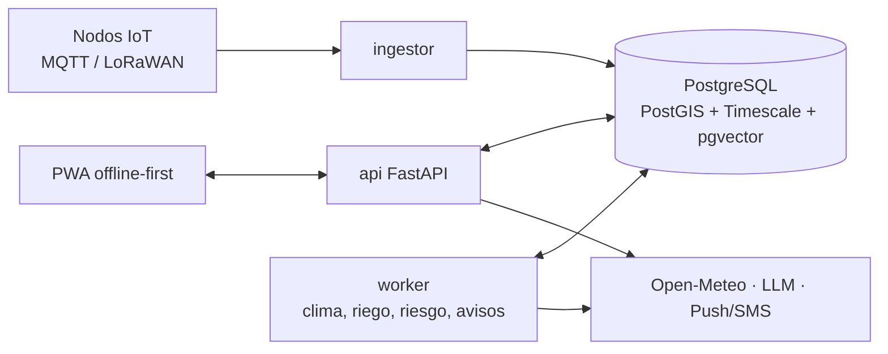

# Diseño del sistema — TechCamp v2

TechCamp v2 tecnifica parcelas del Caribe colombiano:

- **Mide** con sensores IoT y bitácora offline.
- **Decide** con el balance hídrico FAO-56 (en parcelas con riego y de secano), alertas y riesgo climático.
- **Demuestra impacto** con indicadores de tecnificación.

> **Proyecto de seminario:** corre en `localhost` con un simulador de nodos y escenarios ([ADR-0021](adr/0021-perfil-seminario-local.md)). Lo marcado como *producción futura* (VPS, LoRaWAN real, SMS, backups) queda diseñado pero no se implementa en el seminario.

Este directorio es el diseño completo, previo a la implementación. Sigue el método de [karanpratapsingh/system-design](https://github.com/karanpratapsingh/system-design#system-design-interviews): requisitos → estimaciones → modelo de datos → API → alto nivel → detalle → cuellos de botella.

## Resumen en un diagrama

## Orden de lectura

| # | Documento | Responde |
|---|---|---|
| 00 | [Glosario](00-glosario.md) | ¿Qué significa cada término (y cómo se llama en el código)? |
| 01 | [Requisitos](01-requisitos.md) | ¿Qué debe hacer el sistema y con qué calidad? |
| 02 | [Estimaciones](02-estimaciones.md) | ¿Cuánta carga, almacenamiento y costo? |
| 03 | [Modelo de datos](03-modelo-datos.md) | ¿Qué entidades y cómo se guardan? |
| 04 | [API](04-api.md) | ¿Qué contratos exponen el servidor y los nodos? |
| 05 | [Arquitectura](05-arquitectura.md) | ¿Qué componentes hay y cómo se despliegan? |
| 06 | [Diseño detallado](06-diseno-detallado.md) | ¿Cómo funcionan la ingesta, las alertas, el riego, la sincronización y el asistente? |
| 07 | [Frontend y design system](07-frontend-design-system.md) | ¿Cómo se construye la PWA sin repetir los errores de la v1? |
| 08 | [ML](08-ml.md) | ¿Qué modelos necesita la tecnificación y cómo se construyen y gobiernan? |
| 09 | [Cuellos de botella](09-cuellos-de-botella.md) | ¿Qué falla, qué no escala y cómo se protege? |
| 10 | [DAGs](10-dag.md) | ¿En qué orden se construye y cómo fluyen los datos y los jobs? |
| 11 | [Métricas](11-metricas.md) | ¿Cómo se demuestra que el campo se tecnificó? |
| — | [ADRs](adr/README.md) | ¿Por qué se decidió cada cosa? |
| — | [Investigación: tecnificación del campo](investigacion/tecnificacion-campo.md) | ¿El diseño está apegado a la realidad del productor del Caribe? Evidencia de los cambios de diseño |

**Si solo tienes 10 minutos:** lee 01, 05, 11 y los ADRs 0001, 0002, 0009, 0019 y 0021.

## Decisiones clave

| Tema | Decisión | ADR |
|---|---|---|
| Estrategia | Repositorio nuevo, rescate selectivo de la v1 | [0001](adr/0001-nuevo-repositorio-v2.md) |
| Backend | Monolito modular hexagonal (FastAPI) | [0002](adr/0002-monolito-modular.md) |
| Datos | Un solo PostgreSQL con PostGIS + TimescaleDB + pgvector | [0003](adr/0003-postgres-unico.md) |
| IoT | MQTT + LoRaWAN (ChirpStack) | [0004](adr/0004-mqtt-y-lorawan.md) |
| Cliente | PWA offline-first | [0005](adr/0005-pwa-offline-first.md) |
| UI | Design system primero (Tailwind v4 + shadcn/ui) | [0006](adr/0006-design-system.md) |
| IA | LLM por API barata; explica, no decide. Sin Ollama | [0007](adr/0007-llm-por-api.md) |
| Riego | FAO-56; estrés hídrico por parcela (`Dr > RAW`) y sensor que corrige el balance con un peso según su calibración | [0009](adr/0009-riego-fao56.md), [0022](adr/0022-estres-hidrico-y-asimilacion.md) |
| Parcelas | Con riego y de secano: el mismo balance hídrico; lámina solo con sistema de riego, consejo de manejo en secano | [0023](adr/0023-parcelas-con-riego-y-secano.md) |
| Impacto | Impacto contra la encuesta de inscripción de cada parcela; índice de adopción digital que cuenta acciones, no reconocimientos | [0024](adr/0024-metricas-de-impacto-y-adopcion-digital.md) |
| Ejecución | Perfil seminario local con simulador de escenarios; producción futura cambiando adaptadores | [0021](adr/0021-perfil-seminario-local.md) |
| ML | Modelos reconstruidos desde cero con protocolo fijo; solo se promueve lo que supera su mejor línea base | [0019](adr/0019-reconstruccion-de-modelos.md), [0020](adr/0020-protocolo-de-experimentacion-ml.md) |

## Decisiones pendientes para implementación

| Pendiente | Cuándo |
|---|---|
| Proveedor de LLM y de embeddings (evaluación con 30 preguntas) | E12 |
| Proveedor S3 y de SMS/WhatsApp | Producción futura |
| Hardware de nodos LoRaWAN para el plan AU915 (915–928 MHz, ya fijado en [02](02-estimaciones.md#restricciones)); verificar los límites de potencia del Anexo 1 de la Res. ANE 105 de 2020 antes de comprar | Producción futura (E13) |
| Grabar los fixtures de clima de cada escenario | E16 |
| Licencia (uso comercial) y límites de tamaño de TabPFN | E10 |
| Validación agronómica de umbrales de alertas, Kc de variedades locales (y del ñame, sin Kc en FAO-56), `p`, Zr y profundidades de sensor | Antes de la demo (con el asesor o un agrónomo) |
| Paleta y escalas concretas del design system (probadas a pleno sol) | E1 |
| Términos de uso de Open-Meteo si el proyecto se comercializa | Antes del lanzamiento |
